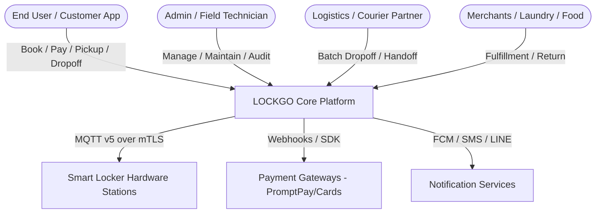
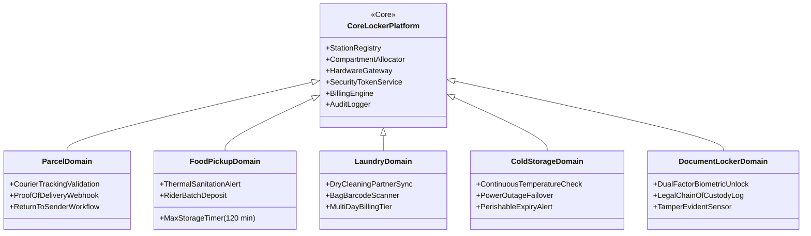

# LOCKGO — Business Scenario & Requirements Analysis (BA Phase)

> **Role:** Business Analyst & Requirements Lead  
> **Platform:** LOCKGO — Next-Gen Smart Locker Platform  
> **Author:** Napaporn Suttinarksombat (Koy) & Elena (Technical Assistant)  
> **Version:** 1.0.0 (Production Blueprint)

---

## 1. Executive Business Overview

LOCKGO is an enterprise-grade, high-reliability **Smart Locker Platform** engineered to solve last-mile logistics bottlenecks, secure physical asset storage, and touchless custody handoffs across high-density urban environments (condominiums, transit hubs, commercial offices, universities, and retail centers).

---

## 2. Stakeholder Personas & Core User Stories

### 2.1 End-User / Customer (Mobile App - iOS / Android)
- **US-01 (Station Discovery):** As a user, I want to search and filter locker stations by geolocation, walking distance, compartment sizes (S, M, L, XL), operating hours, and specialized features (e.g. cold storage) so that I can find a suitable station quickly.
- **US-02 (Slot Reservation):** As a user, I want to reserve a locker compartment with a guaranteed hold window (15 minutes) before arriving at the station so that my slot is not taken by someone else.
- **US-03 (Dynamic Contactless Access):** As a user, I want to open my locker compartment by scanning a dynamic rolling QR code (TOTP/HMAC) or using Bluetooth proximity so that unauthorized parties cannot access my locker via static screenshots.
- **US-04 (Flexible Handoff):** As a user, I want to deposit a package for another person (peer-to-peer or courier pickup) by specifying the recipient's phone number or secure claim token.
- **US-05 (Transparent Billing):** As a user, I want to see clear upfront pricing (base rate + hourly overtime) and pay seamlessly via PromptPay QR, Credit Card, or Mobile Banking.

### 2.2 Field Technicians & Station Operators (Web Backoffice & Mobile Ops)
- **US-06 (Station Telemetry & Monitoring):** As an operator, I want real-time visibility into all station controllers, door sensors (optical/magnetic), compartment locks (solenoid/relay state), ambient temperature, and network connectivity.
- **US-07 (Maintenance Isolation):** As a technician, I want to toggle any compartment into `MAINTENANCE` or `OUT_OF_SERVICE` state so that damaged or jammed doors are instantly removed from the public reservation pool.
- **US-08 (Emergency Override Unlock):** As an authorized supervisor, I want to trigger a dual-authenticated emergency remote unlock with mandatory audit logging and photo proof.

### 2.3 Business Merchants & Logistics Partners (B2B API Integration)
- **US-09 (Batch Dropoff):** As a courier, I want to authenticate at a locker station and deposit multiple packages into distinct compartments in a single continuous session.
- **US-10 (Proof of Delivery Webhook):** As an e-commerce partner, I want to receive real-time webhook events (`DELIVERED`, `PICKED_UP`, `RETURNED_EXPIRED`) with photographic or sensor verification.

---

## 3. Business Rules Matrix & Validation Engine

| Rule ID | Business Domain | Rule Description | Enforcement Layer | Failure Action |
|---|---|---|---|---|
| **BR-001** | Reservation Hold | Maximum reservation hold time is 15 minutes before physical dropoff/arrival. | Redis TTL + Cron Reconciler | Auto-cancel reservation, release compartment to `AVAILABLE`, notify user. |
| **BR-002** | Concurrency Guard | No compartment may have more than one active reservation or occupied session at any millisecond. | Redis Redlock + PostgreSQL `SELECT FOR UPDATE` | Return HTTP 409 Conflict with alternative available slots at same station. |
| **BR-003** | Dynamic QR Expiry | Access QR code must rotate every 30 seconds with a +/- 1 time-step clock drift allowance. | Cryptographic TOTP/HMAC Engine | Reject scan, prompt mobile app to refresh screen. |
| **BR-004** | Single-Use Nonce | Once a QR access token is successfully verified at a station, its cryptographic nonce is immediately burned. | Atomic Redis `SETNX` (Key: `nonce:{id}`, TTL 10m) | Reject replay attack, log security alert in Audit Trail. |
| **BR-005** | Door Open Timeout | Compartment door open duration cannot exceed 3 minutes during deposit/pickup. | Edge Hardware Timer + Server MQTT Alert | Edge beeper sound + Push notification + Flag station warning event. |
| **BR-006** | Food Locker Hygiene | Food pickup compartments have a strict 2-hour maximum storage SLA. | Domain Extension Policy | If unclaimed at T+120m, notify user/courier and initiate disposal protocol. |
| **BR-007** | Cold Storage Temp SLA | Cold compartments must maintain 2°C – 8°C. If temperature exceeds 10°C for > 15 mins, flag alert. | IoT Telemetry Ingestion Worker | Halt new cold bookings, alert technician, dispatch SMS warning to current depositors. |
| **BR-008** | Overtime Billing | Overtime parking past booked duration incurs automatic tiered penalty fees per 30-minute block. | Billing Calculation Engine | Charge on pickup before door release command is dispatched. |

---

## 4. Multi-Domain Business Expansion (Modular Extensibility)

LockGo is architected as an **Extensible Urban Logistics & Storage Platform** capable of supporting diverse business verticals on a single shared hardware infrastructure:

### Architectural Strategy for Zero-Rewrite Domain Expansion
1. **Ports & Adapters / Strategy Pattern:**
   - Core handles hardware abstraction, door locking, transaction boundaries, and telemetry.
   - Domain-specific logic is injected via standardized interfaces:
     - `IReservationPolicy` (e.g. `FoodReservationPolicy` enforces max 2-hour hold).
     - `IBillingPolicy` (e.g. `LaundryBillingPolicy` applies daily rate vs hourly rate).
     - `IAccessValidator` (e.g. `DocumentAccessValidator` requires 2FA confirmation).
2. **Dynamic Metadata JSONB Schema:**
   - Each reservation and compartment carries flexible domain attributes (`metadata: { temperature_target: 4.0, tracking_number: "TH12345", partner_id: "GRUB_01" }`) without requiring schema migrations for every new business vertical.

---

## 5. Non-Functional Requirements (NFRs) & Platform Quality Attributes

| NFR Category | Metric / Target | Architectural Mechanism | Verification Method |
|---|---|---|---|
| **P99 Latency** | < 100ms for reservation & station availability | Redis read-through caching, PostGIS spatial indexing, connection pooling | K6 load test with 500 concurrent virtual users |
| **Availability** | 99.95% uptime SLA (< 4.38h downtime/year) | Multi-AZ deployment, stateless containers, offline edge station fallback | Chaos engineering / Edge disconnection simulation |
| **Data Consistency** | 0% Double Booking under peak race conditions | Redis Redlock + PostgreSQL `SELECT ... FOR UPDATE` + Unique Constraints | Automated concurrency stress test (50 parallel requests for 1 slot) |
| **Security & Privacy** | Zero static credentials, ISO/IEC 27001 readiness | Rolling TOTP/HMAC QR codes, AES-256 token encryption, TLS 1.3, PDPA PII masking | Automated OWASP / Replay attack test suite |
| **IoT Resilience** | Zero command drop during intermittent 4G network | MQTT QoS 1 (At Least Once) + Edge local SQLite queue + 2-Phase reconciliation | Network latency / packet loss chaos simulation |
| **Auditability** | 100% immutable mutation trace | Append-only PostgreSQL `audit_logs` + structured JSON stdout stream | E2E audit trace verification for all mutating endpoints |
