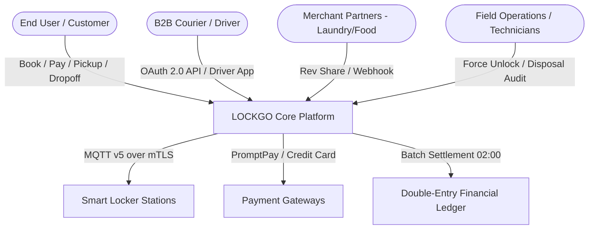

# LOCKGO — Business Scenario, Legal Compliance & Requirements Specification (BA Phase)

> **Role:** Lead Business Analyst & Enterprise Architecture Partner  
> **Platform:** LOCKGO — Next-Gen Smart Locker Platform  
> **Author:** Napaporn Suttinarksombat (Koy) & Elena (Technical Assistant)  
> **Version:** 1.3.0 (Comprehensive Enterprise Business Specification with Operational Edge Policies)

---

## 1. Executive Business Overview & Problem Statement

LOCKGO เป็นแพลตฟอร์ม Smart Locker อัจฉริยะสำหรับแก้ปัญหา Last-Mile Logistics (ซึ่งคิดเป็น 53% ของต้นทุนขนส่งทั้งหมด), บริการรับฝากของปลอดภัยแบบไร้สัมผัส, จุดรับ-ส่งอาหารพร้อมทาน, บริการตู้แช่เย็นสำหรับสินค้าควบคุมอุณหภูมิ และจุดบริการรับส่งผ้าซักอบรีด 24 ชั่วโมง

---

## 2. Legal & Regulatory Compliance Framework

| กฎหมาย / ข้อบังคับ | ขอบเขตการกำกับดูแล | สถาปัตยกรรมและกลไกของระบบ (System Mechanism) |
|---|---|---|
| **1. พ.ร.บ. คุ้มครองผู้บริโภค & พ.ร.บ. ขายตรงและตลาดแบบตรง** | การคุ้มครองสิทธิผู้บริโภคในการซื้อบริการออนไลน์ และสิทธิการได้รับเงินคืนเต็มจำนวนเมื่อระบบขัดข้อง | - **System Error / ตู้ไม่เปิด / ขนาดช่องไม่พอดีและไม่มีช่องใหญ่ว่าง:** คืนเงิน Gross Refund 100% ทันที (บริษัทรับภาระ MDR) - **User Cancellation:** คืนเงิน Net Refund (หักค่าธรรมเนียม PG 5-10 บาท) หรือคืนเป็น 100% In-App Wallet Credit |
| **2. พ.ร.บ. ระบบการชำระเงิน พ.ศ. 2560 (ธปท.)** | ความปลอดภัยของ e-Payment, PromptPay และรอบการกระทบยอดเงิน | - บังคับใช้ `Idempotency-Key` (UUID) ทุก API Call ตัดเงิน - ระบบ **Daily Reconciliation Engine** รัน Batch Job ทุก 02:00 น. เทียบไฟล์ Settlement จาก Payment Gateway กับ Order Logs |
| **3. พ.ร.บ. คุ้มครองข้อมูลส่วนบุคคล พ.ศ. 2562 (PDPA)** | การจัดเก็บเบอร์โทรศัพท์, ข้อมูลการจ่ายเงิน, และภาพถ่ายหน้าตู้ | - **PII Masking** ใน Audit Log (เช่น `081-****-1234`) - ลบภาพถ่ายสแกนเนอร์/CCTV ที่ไม่เกี่ยวข้องทิ้งทุก 30 วัน (Data Retention Policy) |
| **4. พ.ร.บ. ป้องกันและปราบปรามการฟอกเงิน (AMLO) & วัตถุอันตราย** | การตรวจสอบตัวตนผู้ใช้บริการในพื้นที่เสี่ยงหรือธุรกรรมผิดปกติ | - **KYC Level 1 (ทั่วไป):** OTP เบอร์มือถือ + Device ID Fingerprint - **KYC Level 2 (พื้นที่เสี่ยง/สนามบิน/ฝากเกิน 24h):** สแกนบัตรประชาชน (Dip-Chip/OCR) หรือ Passport |
| **5. ป.พ.พ. เรื่องการฝากทรัพย์และรับขน** | การกำหนดเพดานความรับผิดชอบและการประกันภัยทรัพย์สิน | - **Standard Plan:** ชดเชยสูงสุดไม่เกิน 2,000 บาท/รายการ - **Declared Value Insurance:** ซื้อประกันเพิ่ม 10-20 บาท สำหรับของมูลค่าเกิน 2,000 บาท คุ้มครองสูงสุด 20,000 บาท |
| **6. พ.ร.บ. อาหาร พ.ศ. 2522 & สาธารณสุข** | การควบคุมสุขอนามัยอาหารพร้อมบริโภคและห่วงโซ่ความเย็น | - แจ้งเตือนเมื่อเกิน 3 ชั่วโมง และเปลี่ยนสถานะเป็น `DISPOSAL_PENDING` เพื่อทำลายทิ้งทันทีเมื่อครบ 6 ชั่วโมง - ตู้แช่เย็นต้องคุมอุณหภูมิ 2°C - 8°C ตลอดเวลา |

---

## 3. Operational Edge Policies & Business Workflows

### 3.1 นโยบายเมื่อผู้ใช้ "ลืมปิดประตูตู้" (Door Left Ajar Policy)
- **Escalation Sequence:**
  - **0 - 30 วินาที:** ระบบรออย่างเงียบๆ (Normal Operation)
  - **30 วินาที:** ตู้เริ่มส่งเสียงเตือน Buzzer จังหวะช้าหน้าตู้ พร้อมยิง Push Notification เข้ามือถือผู้ใช้ (*"กรุณาปิดประตูตู้ Locker หมายเลข X"*)
  - **90 วินาที:** Buzzer เปลี่ยนเป็นเสียงเตือนความถี่สูง (High-Pitch Alarm) พร้อมส่ง SMS เตือนด่วน
  - **180 วินาที (3 นาที):** Edge Daemon เปลี่ยนสถานะช่องเป็น `DOOR_AJAR_ALERT`
- **Security & Financial Control:**
  - **ห้ามตัดจบเป็น `COMPLETED` เด็ดขาด** เพื่อป้องกันปัญหาสินค้าสูญหายหรือคนอื่นมาแอบหยิบของ
  - ระบบเปลี่ยนสถานะ Transaction เป็น `PENDING_INVESTIGATION`
  - Trigger Alarm Event ไปที่ Central Operations Dashboard พร้อมดึงภาพกล้อง CCTV เพื่อให้ทีม Ops โทรหาผู้ใช้ทันที หรือส่งเจ้าหน้าที่ Field Ops เข้าปิดตู้

### 3.2 กรณี "พัสดุชิ้นใหญ่เกินขนาดช่องที่จอง" (Seamless Size Upgrade Workflow)
- ในขณะที่สถานะเป็น `DEPOSITING` (ยังไม่ได้ปิดประตูกดส่งของ) หน้าตู้และแอปจะแสดงปุ่ม **"เปลี่ยนขนาดช่อง / Change Locker Size"**
- **Upgrade Execution:**
  - ระบบตรวจสอบความพร้อมของช่องไซส์ใหญ่ขึ้น (เช่น L หรือ XL) ในสถานีเดียวกัน
  - **กรณีมีช่องว่าง:** ระบบส่งคำสั่ง `CANCEL_LOCK` ช่องเดิมคืนเป็น `AVAILABLE` -> สร้าง Sub-Order คำนวณส่วนต่างราคา -> ลูกค้าชำระเงินส่วนต่างผ่าน In-App Payment -> ปลดล็อกช่องใหม่ทันที
  - **กรณีไม่มีช่องว่าง:** แสดงข้อความแจ้งเตือน และแสดงปุ่ม *"ยกเลิกรายการและคืนเงินเต็มจำนวน (Auto Full Refund 100%)"*

### 3.3 กรณี "โทรศัพท์ผู้ใช้แบตเตอรี่หมดหน้าตู้" (Emergency Backup PIN)
- **SMS Backup PIN:** เมื่อทำการจองสำเร็จ ระบบจะส่งรหัสฉุกเฉิน **Backup PIN (ตัวเลข 6 หลัก)** แนบไปทาง SMS ของเบอร์โทรศัพท์ผู้ใช้เสมอ
- **Kiosk Emergency Unlock:** ผู้ใช้สามารถกดปุ่ม *"Emergency Unlock"* ที่หน้าจอ Touchscreen Kiosk -> กรอกเบอร์โทรศัพท์ + Backup PIN 6 หลัก
- **Brute-Force Guardrail:**
  - PIN มีอายุตาม Session การจองเท่านั้น
  - หากกรอก PIN ผิดติดต่อกัน **เกิน 3 ครั้ง** ระบบจะ Lock หน้าจอเมนู Emergency ของเบอร์นั้นเป็นเวลา 15 นาที พร้อมยิง Security Alert ขึ้นระบบ Monitoring ทันที

### 3.4 โครงสร้างต้นทุน ค่าธรรมเนียม และการคืนเงิน (MDR & Settlement)
1. **PromptPay (QR Payment):** ค่าธรรมเนียม 0.15% - 0.5% (บริษัทออกค่าใช้จ่ายเองเพื่อลด Friction)
2. **Credit/Debit Card:** MDR 1.5% - 2.5% (บริษัทออกค่าใช้จ่ายเอง โดยถัวเฉลี่ยใน Margin ของราคาบริการแล้ว)
3. **Settlement Cycle (T+1):** กระทบยอดเงินทุกวันเวลา 02:00 น. ผ่าน Automated Reconciliation Engine

### 3.5 กระบวนการจัดการของตกค้างและของเสีย (Abandoned & Disposal Policy)
- **พัสดุทั่วไป (Parcel / General):** ครบ 48 ชม. -> คิดค่าบริการล่วงเวลา (Overtime Charge) -> ครบ 7 วัน -> `ABANDONED` -> Field Ops นำเข้าคลังกลาง (Central Hub)
- **อาหารสด (Food / Perishable):** เกิน 3 ชม. -> Alert -> เกิน 6 ชม. -> `DISPOSAL_PENDING` -> ทำลายทิ้งทันที
- **Field Ops Proof of Work:** บังคับสิทธิ์ `ROLE_FIELD_OPS` ถ่ายรูปสิ่งของอัปโหลดขึ้น S3 ก่อนกดยืนยันปิดงาน (`CLEARED`)

---

## 4. Stakeholder Personas & Core User Stories

### 4.1 End-User / Customer (Mobile App & Kiosk)
- **US-01 (Discovery & Operating Hours):** ค้นหาตู้พร้อมแสดงเวลาเปิด-ปิดของสถานที่ และสถานะช่องว่างแบบเรียลไทม์
- **US-02 (Item Category & Declared Value):** เลือกประเภทสิ่งของ และระบุมูลค่าโดยประมาณ พร้อมตัวเลือกซื้อประกันภัยคุ้มครองสูงสุด 20,000 บาท
- **US-03 (Payment & Dynamic QR):** ชำระเงินผ่าน PromptPay/บัตรเครดิต และรับ Dynamic Rolling QR Code หมุนเปลี่ยนทุก 30 วินาที
- **US-04 (Emergency PIN Fallback):** ปลดล็อกตู้ด้วย Backup PIN 6 หลักผ่านหน้าจอ Kiosk เมื่อแบตเตอรี่โทรศัพท์หมด
- **US-05 (Seamless Size Upgrade):** ขอย้ายไปช่องขนาดใหญ่ขึ้นพร้อมจ่ายเงินส่วนต่างได้ทันทีขณะอยู่หน้าตู้

### 4.2 B2B Courier & Field Operations Staff
- **US-06 (Batch Driver Dropoff):** คนขับขนส่งสแกน Barcode พัสดุหลายชิ้นและเปิดตู้ต่อเนื่องได้ในรอบเดียว
- **US-07 (Disposal & Abandoned Clearance):** สั่ง Force Unlock เพื่อเก็บพัสดุตกค้าง (>7 วัน) หรือทำลายอาหารเน่าเสีย (>6 ชม.) พร้อมถ่ายรูปอัปโหลด S3
- **US-08 (Door Ajar Investigation):** รับแจ้งเตือนประตูตู้เปิดค้างเกิน 3 นาทีพร้อมดูภาพ CCTV เพื่อเข้าแก้ไข
