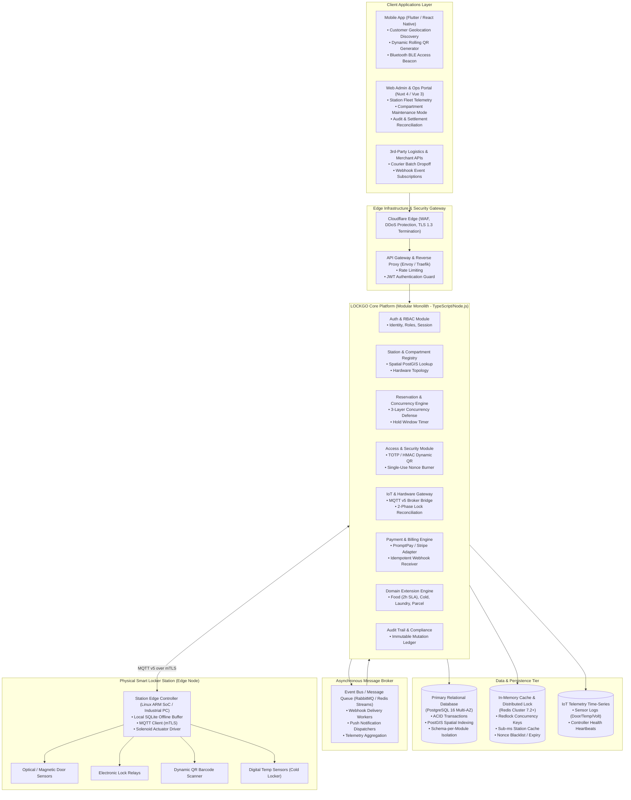
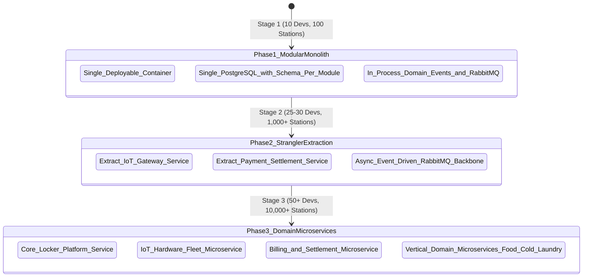
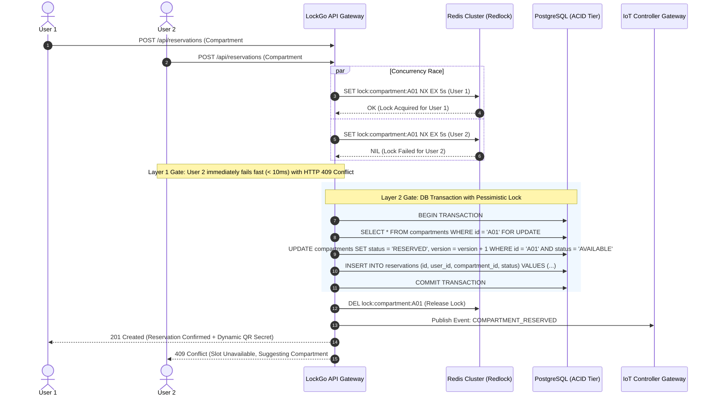
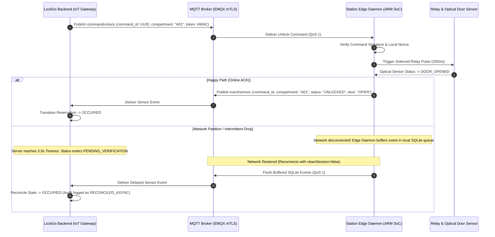
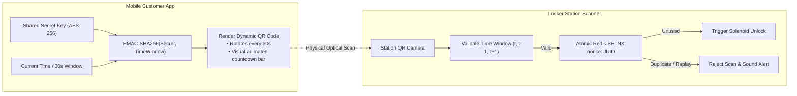

# LOCKGO — System Architecture & Technical Design (SA Phase)

> **Role:** Chief System Architect & Platform Lead  
> **Platform:** LOCKGO — Next-Gen Smart Locker Platform  
> **Author:** Napaporn Suttinarksombat (Koy) & Elena (Technical Assistant)  
> **Version:** 1.0.0 (Production Architecture Blueprint)

---

## 1. High-Level System Architecture (C4 Model - Container Level)

LockGo is designed as a **Modular Monolith core** with an **Event-Driven Asynchronous Messaging Backbone** and **Edge IoT Gateways** for physical smart locker stations.



---

## 2. Core Architectural Components & Technology Stack Justification

| Component | Technology | Rationale & Architectural Trade-off |
|---|---|---|
| **Backend Runtime** | Node.js (v22 LTS) / TypeScript strict | High I/O throughput for asynchronous hardware event streams, strong typing across domain contracts, unified fullstack TypeScript ecosystem. |
| **Primary Database** | PostgreSQL 16 + PostGIS extension | Full ACID compliance for financial/reservation transactions, PostGIS for geospatial station searches (`ST_DWithin`), JSONB for dynamic vertical metadata. |
| **Cache & Distributed Lock** | Redis Cluster 7.2+ | In-memory atomic operations (`SETNX`, Lua scripts, Redlock) for sub-100ms lock arbitration and instant QR code nonce consumption. |
| **IoT Message Broker** | MQTT v5 over mTLS (EMQX / Mosquitto) | Ultra-lightweight pub/sub protocol with QoS 1, Keep-Alive heartbeats, and binary payload efficiency over cellular 4G/5G connections. |
| **Event Queue & Workers** | RabbitMQ / BullMQ | Durable message queuing for asynchronous background jobs (SMS/FCM notifications, webhook retries with exponential backoff). |
| **Edge Hardware Controller** | Linux ARM SoC + Python/Rust daemon | Local offline buffer (SQLite) to store authorized access tokens and queue telemetry events during network partitioning. |
| **Web Admin & Ops** | Nuxt 4 / Vue 3 + Tailwind CSS | High productivity component model, server-side rendering for backoffice dashboards, type-safe API client generation. |
| **Observability & APM** | OpenTelemetry + Prometheus + Grafana + Loki | End-to-end distributed tracing correlating HTTP API requests -> PostgreSQL transactions -> MQTT hardware events. |

---

## 3. In-Depth Architecture Evaluation: Monolith vs Modular Monolith vs Microservices

### 3.1 Comparative Trade-Off Matrix

| Evaluation Criteria | Option A: Monolithic Application | Option B: Modular Monolith (CHOSEN) | Option C: Microservices Architecture |
|---|---|---|---|
| **Time to Market (MVP)** | Very Fast (1-2 months) | **Fast (2-3 months)** | Slow (5-8 months due to infra setup) |
| **Domain Boundary Enforcement** | Poor (Spaghetti database queries) | **High (Enforced via TypeScript modules & DB schemas)** | Very High (Physical network boundaries) |
| **Deployment Complexity** | Single container / binary | **Single container / binary** | Complex (Kubernetes, Helm, Istio Service Mesh) |
| **Data Consistency & ACID** | Immediate ACID in single DB | **Immediate ACID in single PostgreSQL cluster** | Eventual Consistency (Requires distributed Sagas & Outbox) |
| **Team Scalability (10 -> 50 devs)** | Poor (Merge conflicts, high blast radius) | **Excellent (Teams own distinct domain modules)** | Excellent (Teams own independent deployment units) |
| **Infra & Operational Cost** | Minimal | **Minimal to Moderate** | High (Multi-cluster, VPC peering, egress costs) |
| **Future Extraction Path** | Painful rewrite | **Zero-effort Strangler Extraction** | Already decomposed |

### 3.2 Architectural Judgment & Evolutionary Roadmap



#### Step-by-Step Transition Triggers (Strangler Fig Pattern):
1. **Trigger 1 (IoT Socket Fan-out):** When station count reaches 1,000+ physical units (10,000+ persistent MQTT/WebSocket connections), extract `IoT Gateway Service` into a dedicated Go/Rust microservice to decouple network socket memory from business HTTP traffic.
2. **Trigger 2 (Financial PCI-DSS Compliance):** When transaction volume requires isolated security audit perimeters, extract `Payment & Settlement Service` into a dedicated hardened network zone with isolated database credentials.
3. **Trigger 3 (Vertical Domain Divergence):** When Cold Locker real-time temperature stream analytics require specialized event processing clusters (e.g. Apache Flink), extract domain workers into independent serverless/container workers.

---

## 4. Relational Data Model & Database Schema Design (PostgreSQL 16)

```mermaid
erDiagram
    STATIONS ||--o{ COMPARTMENTS : contains
    STATIONS ||--o{ STATION_TELEMETRY : logs
    COMPARTMENTS ||--o{ RESERVATIONS : allocates
    COMPARTMENTS ||--o{ HARDWARE_EVENTS : triggers
    USERS ||--o{ RESERVATIONS : books
    RESERVATIONS ||--o| PAYMENTS : bills
    RESERVATIONS ||--o| ACCESS_TOKENS : secures
    USERS ||--o{ AUDIT_LOGS : performs

    STATIONS {
        uuid id PK
        string station_code UK "e.g. BKK-ASOKE-01"
        string name
        geometry location_point "PostGIS (lat, lng)"
        string address
        string status "ACTIVE, MAINTENANCE, OFFLINE"
        jsonb hardware_config
        timestamp created_at
        timestamp updated_at
    }

    COMPARTMENTS {
        uuid id PK
        uuid station_id FK
        string compartment_number "e.g. A01"
        string size_tier "S, M, L, XL"
        string domain_vertical "PARCEL, FOOD, COLD, LAUNDRY"
        string status "AVAILABLE, RESERVED, OCCUPIED, MAINTENANCE"
        int lock_relay_index "Hardware GPIO channel"
        int version "Optimistic lock counter"
        jsonb metadata
        timestamp created_at
        timestamp updated_at
    }

    USERS {
        uuid id PK
        string email UK
        string phone_number UK
        string password_hash
        string role "ADMIN, STAFF, CUSTOMER, COURIER"
        timestamp created_at
    }

    RESERVATIONS {
        uuid id PK
        uuid user_id FK
        uuid compartment_id FK
        string reservation_code UK "Dynamic 8-char ref"
        string status "PENDING, ACTIVE, COMPLETED, EXPIRED, CANCELLED"
        timestamp start_time
        timestamp hold_expires_at "Hold SLA (15 mins)"
        timestamp completed_at
        string domain_type "PARCEL, FOOD, COLD, LAUNDRY"
        jsonb domain_attributes
        timestamp created_at
        timestamp updated_at
    }

    ACCESS_TOKENS {
        uuid id PK
        uuid reservation_id FK UK
        string dynamic_totp_secret "Encrypted AES-256"
        string pickup_pin_hash
        string status "ACTIVE, CONSUMED, REVOKED, EXPIRED"
        timestamp last_rotated_at
        timestamp expires_at
    }

    PAYMENTS {
        uuid id PK
        uuid reservation_id FK
        decimal amount
        string currency "THB"
        string payment_method "PROMPTPAY, CREDIT_CARD, WALLET"
        string status "PENDING, SUCCESS, FAILED, REFUNDED"
        string transaction_reference UK
        jsonb gateway_response
        timestamp created_at
    }

    AUDIT_LOGS {
        uuid id PK
        uuid actor_id FK
        string actor_role
        string action "RESERVE, UNLOCK, OVERRIDE, STATE_CHANGE"
        string resource_type "COMPARTMENT, RESERVATION, STATION"
        uuid resource_id
        jsonb before_state
        jsonb after_state
        string ip_address
        timestamp created_at
    }
```

---

## 5. Concurrency Strategy: 3-Layer Defense Against Double-Booking

To guarantee **0% double booking** under extreme race conditions (e.g. 100 users attempting to book the last available compartment simultaneously):



### 3 Defense Layers Detailed:
1. **Layer 1 (Distributed In-Memory Gate - Redis Redlock):**
   - Key: `lock:compartment:{compartment_id}`
   - TTL: 5,000ms
   - Atomic `SET key value NX PX 5000`. Fast-fails 99% of concurrent requests in < 5ms without placing load on the relational database.
2. **Layer 2 (Database State & Row-Level Lock - PostgreSQL):**
   - Executed inside a `SERIALIZABLE` or `READ COMMITTED` transaction with `SELECT ... FOR UPDATE`.
   - Checks `status = 'AVAILABLE'`. If status has flipped, the transaction rolls back immediately.
3. **Layer 3 (Database Engine Physical Unique Constraint):**
   - Partial Unique Index:
     ```sql
     CREATE UNIQUE INDEX idx_unique_active_compartment_reservation 
     ON reservations (compartment_id) 
     WHERE status IN ('PENDING', 'ACTIVE');
     ```
   - Even in the event of an infrastructure crash or Redis split-brain, the PostgreSQL storage engine physically rejects duplicate active reservations at the disk layer.

---

## 6. IoT Locker Hardware Protocol & Offline Fault Tolerance

### 6.1 MQTT Topic Hierarchy & Message Contracts

| Direction | MQTT Topic Pattern | QoS | Purpose |
|---|---|---|---|
| **Server -> Station** | `lockgo/station/{stationId}/command/unlock` | QoS 1 | Dispatch door unlock command with UUID & HMAC |
| **Station -> Server** | `lockgo/station/{stationId}/event/sensor` | QoS 1 | Door open/close sensor signal, lock position |
| **Station -> Server** | `lockgo/station/{stationId}/telemetry/heartbeat` | QoS 0 | Controller status, CPU, memory, temp (every 30s) |
| **Station -> Server** | `lockgo/station/{stationId}/event/scan` | QoS 1 | Barcode/QR scan event from station camera |

### 6.2 Two-Phase Lock State Reconciliation Workflow



### 6.3 Edge Offline Resilience Mechanism:
1. **Local SQLite Cache on Station Controller:** Stores valid reservation tokens for the next 60 minutes. If 4G network drops, customers with pre-existing reservations can still scan their Dynamic QR code at the physical station camera, and the local Edge daemon can authorize the unlock offline.
2. **Replay & Reconciliation Ledger:** All offline unlocks are recorded with timestamp and cryptographic signature in local SQLite, and synced to the cloud server immediately upon network reconnection.

---

## 7. Dynamic TOTP / HMAC QR Security & Anti-Screenshot Mechanism

To prevent screenshot sharing, photo tampering, and replay attacks on physical lockers:



- **Rotation Interval:** 30 seconds.
- **Clock Drift Tolerance:** Validates current window $T_0$, past window $T_{-1}$, and next window $T_{+1}$ (maximum 60-second validity).
- **Single-Use Cryptographic Nonce:** Each generated QR payload contains a unique transaction UUID. When scanned, the backend executes `SET nonce:{uuid} 1 NX EX 600`. If key already exists, request is immediately rejected as a replay attack.
