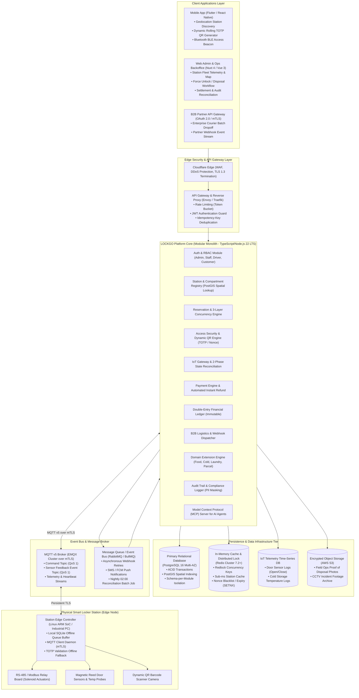
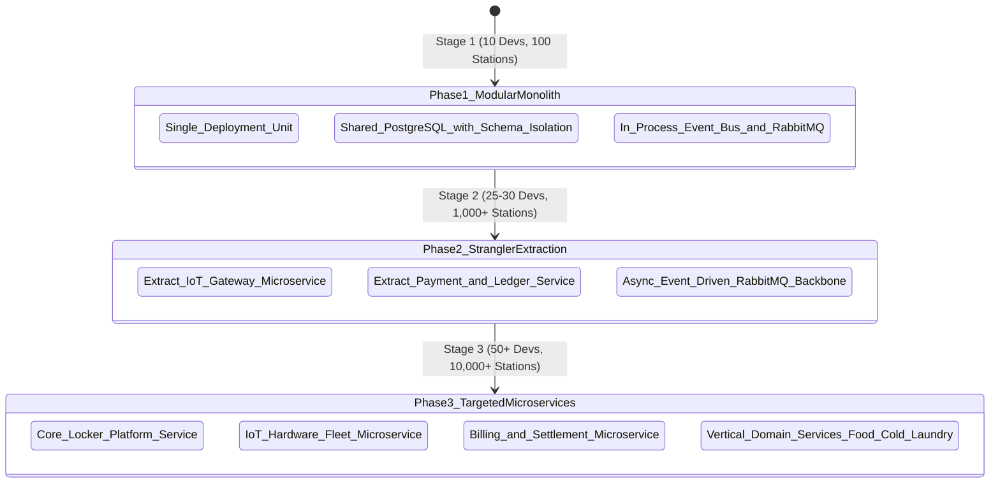
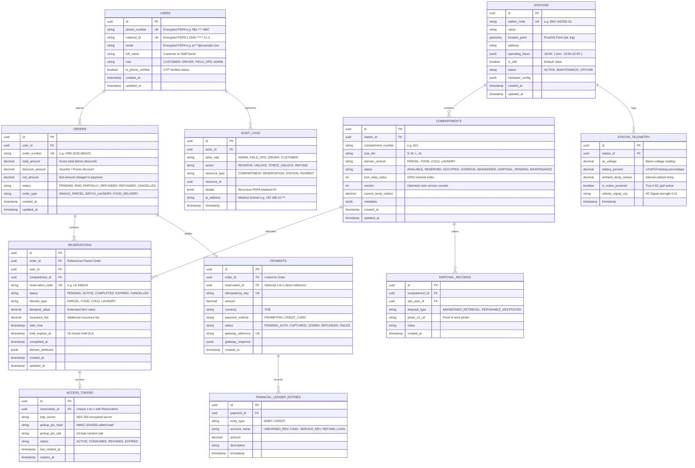
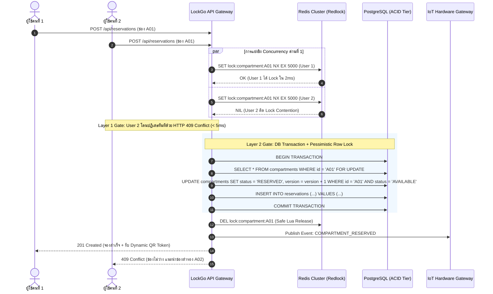
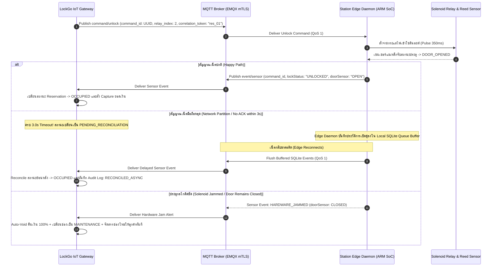
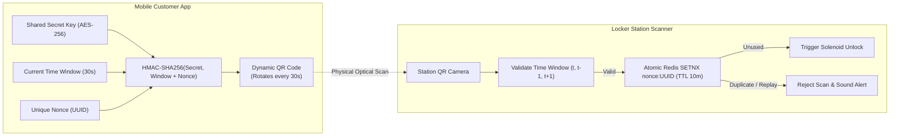

# LOCKGO — System Architecture & Technical Design Specification (SA Phase)

> **Role:** Chief System Architect & Platform Engineering Lead  
> **Platform:** LOCKGO — Next-Gen Smart Locker Platform  
> **Author:** Napaporn Suttinarksombat (Koy) & Elena (Technical Assistant)  
> **Version:** 1.2.0 (Comprehensive Enterprise Architecture Specification)

---

## 1. High-Level System Architecture (C4 Model - Container Level)

LOCKGO ใช้สถาปัตยกรรมแบบ **Modular Monolith Core** ร่วมกับ **Event-Driven Asynchronous Messaging Backbone** และ **Edge IoT Gateways** สำหรับการเชื่อมต่อตู้ฮาร์ดแวร์จริงทั่วประเทศ



---

## 2. Technology Stack Selection & Benchmark Justification

| Layer / Component | Chosen Technology | Rationale, Performance & Benchmark Evidence |
|---|---|---|
| **Backend Runtime** | Node.js (v22 LTS) / TypeScript strict | High I/O throughput สำหรับ Asynchronous MQTT/HTTP streams; Type-safety ครอบคลุม Domain Contracts; ใช้ TypeScript ร่วมกันทั้ง Web, Backend และ Test Suite |
| **Primary Database** | PostgreSQL 16 + PostGIS | ACID Compliance แท้จริงสำหรับธุรกรรมการเงินและการจอง; PostGIS รองรับ Spatial Query (`ST_DWithin`) ในเวลา < 5ms; มี JSONB สำหรับ Dynamic Domain Metadata |
| **Cache & Distributed Lock** | Redis Cluster (v7.2+) | Latency ต่ำ 1-3ms; มีคำสั่ง Atomic Primitives (`SETNX`, Lua scripts, Redlock) สำหรับการตัด Concurrency ด่านหน้าและการเผา Nonce ป้องกัน Replay Attack |
| **IoT Message Broker** | EMQX Cluster (MQTT v5 over mTLS) | Packet Header ขนาดเพียง 2 Bytes (ประหยัด Data SIM 4G กว่า 85-90% เทียบกับ HTTP); รองรับ persistent connection ได้กว่า 1,000,000 concurrent sockets |
| **Event Bus & Worker Queue**| RabbitMQ / Redis Streams | ป้องกัน Message Loss ด้วย At-Least-Once Delivery; มี Dead Letter Exchange (DLX) สำหรับ Webhook Retry แบบ Exponential Backoff |
| **Edge Hardware Daemon** | Linux ARM SoC + Python/Rust | มี Local SQLite Buffer เก็บ Active Tokens ล่วงหน้า 60 นาที ทำให้ลูกค้าสแกนเปิดตู้ได้แม้เน็ต 4G ดับชั่วคราว |
| **Observability & APM** | OpenTelemetry + Prometheus + Loki | Distributed Tracing ครอบคลุมตั้งแต่ HTTP Request -> DB Transaction -> MQTT Hardware Event พร้อม Structured JSON Logs |

---

## 3. Architecture Decision: Monolith vs Modular Monolith vs Microservices (ADR-001)

### 3.1 Comparative Evaluation Matrix

| เกณฑ์การประเมิน | Option A: Traditional Monolith | Option B: Modular Monolith (CHOSEN) | Option C: Pure Microservices |
|---|---|---|---|
| **Time to Market (MVP)** | เร็วมาก (1-2 เดือน) | **เร็ว (2-3 เดือน)** | ช้ามาก (5-8 เดือน จาก Infra Overhead) |
| **การแบ่งขอบเขต Domain (Boundaries)** | ต่ำ (เสี่ยงต่อ Spaghetti Code/DB Joins) | **สูงมาก (บังคับผ่าน TypeScript Modules & DB Schemas)** | สูงมาก (แยกตาม Physical Network Boundaries) |
| **ความซับซ้อนในการ Deploy** | ต่ำ (Single Container/Artifact) | **ต่ำ (Single Container/Artifact)** | สูงมาก (Kubernetes, Helm, Istio, Egress Cost) |
| **ความปลอดภัยของข้อมูล (ACID Transactions)** | ACID ทันทีใน Database เดียว | **ACID ทันทีใน Database เดียว (Single DB Cluster)** | ต้องใช้ Distributed Saga & Outbox (Eventual Consistency) |
| **ความพร้อมของทีม (10 -> 50 วิศวกร)** | แย่ (เสี่ยงต่อ Merge Conflicts และ Regression) | **ยอดเยี่ยม (แต่ละทีมเป็นเจ้าของ Module ชัดเจน)** | ยอดเยี่ยม (แต่ละทีมแยก Service อิสระ) |
| **ต้นทุน Infra & โครงสร้างพื้นฐาน** | ต่ำมาก | **ต่ำถึงปานกลาง** | สูงมาก (Multi-cluster, VPC Peering, NAT Gateway) |
| **เส้นทางการขยายระบบในอนาคต** | รื้อระบบใหม่ทั้งหมด | **แยก Service ได้ทันทีด้วย Strangler Fig Pattern** | แยกอยู่แล้ว |

### 3.2 Roadmap การขยายสถาปัตยกรรม (Strangler Fig Evolutionary Path)



#### เงื่อนไขการแยก Service (Triggers):
1. **Trigger 1 (IoT Socket Fan-out):** เมื่อจำนวนตู้เกิน 1,000 ตู้ (การเชื่อมต่อ MQTT/WebSocket ค้างเกิน 10,000 sockets) -> แยก `IoT Gateway Service` ออกเป็น Microservice อิสระที่เขียนด้วย Go/Rust เพื่อแยก Socket Memory ออกจาก HTTP Traffic
2. **Trigger 2 (PCI-DSS & Financial Audit):** เมื่อปริมาณธุรกรรมการเงินต้องการ Security Perimeter แยกต่างหาก -> แยก `Payment & Settlement Service` ออกไปใช้ฐานข้อมูลและสิทธิ์เครือข่ายเฉพาะ
3. **Trigger 3 (Cold Locker Telemetry Stream Analytics):** เมื่อตู้แช่เย็นต้องประมวลผล Time-Series Stream อุณหภูมิแบบ Real-time -> แยก `Cold Storage Telemetry Worker` ออกไปรันบน Dedicated Container

---

## 4. Relational Database Schema & Data Model (PostgreSQL 16)



### 4.1 Domain Bounded Contexts: Orders vs Reservations (Domain Design Rationale)
ในการออกแบบระบบ LOCKGO เราแยก Bounded Contexts ของ **`ORDERS` (พาณิชย์และการเงิน)** ออกจาก **`RESERVATIONS` (ฮาร์ดแวร์และการจัดสรรตู้)** อย่างชัดเจน:
- **`ORDERS` (Commercial Lifecycle):** รับผิดชอบเรื่องยอดเงินรวม, คูปองส่วนลด, การรวมคำสั่งซื้อหลายช่อง (Batch/Basket Checkout เช่น ซักอบรีด 3 ตะกร้า), ใบเสร็จรับเงิน และภาษีมูลค่าเพิ่ม
- **`RESERVATIONS` (Hardware & Slot Allocation Lifecycle):** รับผิดชอบเรื่องการจัดสรรช่องตู้ทางกายภาพ, Concurrency Lock (Redlock + SELECT FOR UPDATE), Dynamic TOTP QR Token, และ IoT Solenoid Unlock State Machine
- **ความสัมพันธ์ในเฟสต่างๆ:** ในเฟส MVP ธุรกรรม 1 รายการมีความสัมพันธ์แบบ 1-to-1 กับการจอง 1 ช่อง จึงผูก `PAYMENTS` เข้ากับ `RESERVATIONS` โดยตรงเพื่อลดความซับซ้อน แต่แยก Domain Boundary ไว้ล่วงหน้า ทำให้ในเฟสถัดไปสามารถเพิ่มเอนทิตี `ORDERS 1-to-Many RESERVATIONS` เพื่อรองรับ Multi-Compartment Basket Checkout ได้ทันทีโดยไม่ต้องรื้อ Concurrency Engine

---

## 5. Concurrency Strategy: 3-Layer Defense Against Double-Booking (ADR-002)

เพื่อรับประกันอัตรา **Double Booking = 0.000%** ภายใต้การกดจองช่องสุดท้ายพร้อมกัน ณ มิลลิวินาทีเดียวกัน:



### รายละเอียด 3 ด่านป้องกัน (3 Defense Layers):
1. **Layer 1 (Fast In-Memory Gate - Redis Redlock):**
   - Key: `lock:compartment:{id}`, TTL: 5,000ms
   - Atomic `SET key value NX PX 5000` กรองคำขอที่ชนกันทิ้งได้กว่า 98% ภายใน 2-3ms โดยไม่สร้างโหลดให้กับ Database
2. **Layer 2 (Database Transaction & Pessimistic Row Lock - PostgreSQL):**
   - รันใน Transaction ด้วย `SELECT ... FOR UPDATE` และเช็ค `status = 'AVAILABLE'` หากสถานะเปลี่ยนไประหว่างรอ ให้ Rollback ทันที
3. **Layer 3 (Database Engine Physical Unique Constraint):**
   - Partial Unique Index ที่ระดับ Storage Engine ของ PostgreSQL:
     ```sql
     CREATE UNIQUE INDEX idx_unique_active_compartment_reservation 
     ON reservations (compartment_id) 
     WHERE status IN ('PENDING', 'ACTIVE');
     ```
   - แม้เกิดเหตุ Redis Crash หรือ Split-Brain Database Engine จะ Physically Reject คำขอจองซ้ำที่ระดับดิสก์ 100%

---

## 6. IoT Locker Hardware Protocol & Two-Phase Lock State Reconciliation (ADR-003)

### 6.1 MQTT Topic Topology (QoS 1)
- **Command Topic (Cloud -> Station):** `lockgo/station/{stationId}/command/unlock`
- **Feedback Event Topic (Station -> Cloud):** `lockgo/station/{stationId}/event/sensor`
- **Telemetry Stream (Station -> Cloud):** `lockgo/station/{stationId}/telemetry/heartbeat`

### 6.2 Two-Phase Lock State Reconciliation Flowchart



---

## 7. Dynamic TOTP / HMAC-SHA256 QR Security & Anti-Screenshot Replay Defense (ADR-004)



- **Rotation Window:** 30 วินาที
- **Clock Drift Tolerance:** ยอมรับ Window $T_0, T_{-1}, T_{+1}$ (ยืดหยุ่นได้ $\pm 30$ วินาที)
- **Single-Use Nonce Burner:** ทุก QR Code มี UUID ฝังอยู่ เมื่อสแกนผ่าน ระบบจะรันคำสั่ง Redis `SETNX nonce:{uuid} 1 EX 600` หากได้ค่า `0` แปลว่าเป็นโค้ดที่เคยใช้ไปแล้ว (Replay Attack) และจะปฏิเสธการเปิดตู้ทันที
