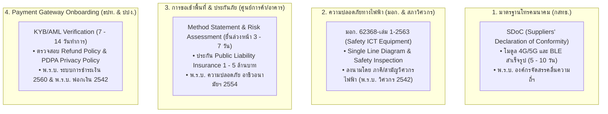

# LOCKGO — Project Execution Plan & Work Breakdown Structure (PM Phase)

> **Role:** Technical Project Manager & Delivery Lead  
> **Platform:** LOCKGO — Next-Gen Smart Locker Platform  
> **Author:** Napaporn Suttinarksombat (Koy) & Elena (Technical Assistant)  
> **Version:** 1.8.0 (Comprehensive Enterprise Delivery Blueprint with Internal Tools Matrix)

---

## 1. Project Charter & Delivery Strategy

### 1.1 Objective
ส่งมอบแพลตฟอร์มต้นแบบ Smart Locker "LOCKGO" ในระดับ **Production-Grade Prototype** ภายในกรอบเวลา **72 ชั่วโมง** โดยสะท้อนมาตรฐานวิศวกรรมระดับ **Senior AI Fullstack Platform Engineer** ครอบคลุมทั้ง System Architecture, Concurrency Defense, Hardware/IoT Fault-Tolerance, Dynamic Security, Model Context Protocol (MCP) และ DevOps Governance

### 1.2 Pragmatic Scope Management (Anti-Overengineering Principle)
ตามกฎ **Karpathy Law A1 (Simplicity First)** และ **A4 (Design Laws)**:
- **เน้นแก่นคุณค่าสูงสุด (High-Value Critical Paths):** พัฒนา Modular Monolith ด้วย TypeScript ที่มีความสมบูรณ์แบบของ Business Logic, 3-Layer Concurrency Locking (0.000% Double Booking), Dynamic TOTP QR 30s + Nonce Burner, Emergency PIN Salt/Hash, Two-Phase Payment/Ledger, PII Masking, และ IoT 2-Phase Reconciliation
- **ขอบเขตที่สมเหตุสมผล:** ไม่ตั้ง Kubernetes Cluster 15 โหนด แต่ใช้ **Docker Compose, PostgreSQL 16 + PostGIS, Redis Cluster และ IoT Hardware Simulator** ที่จำลองสถานการณ์เครือข่ายหลุดและเซนเซอร์ติดขัดได้อย่างสมจริง 100%

---

## 2. กฎหมาย มาตรฐานอุตสาหกรรม และการขอใบอนุญาต (Regulatory Standards & Certifications)

| ด้านการกำกับดูแล | มาตรฐาน / กฎหมายอ้างอิง | ระยะเวลาดำเนินการ (Lead Time) | รายละเอียดและข้อกำหนดทางเทคนิค |
|---|---|---|---|
| **1. อุปกรณ์โทรคมนาคม** | **สำนักงาน กสทช.** (พ.ร.บ. องค์กรจัดสรรคลื่นความถี่ฯ) | 5 - 10 วันทำการ (Pre-certified) | โมเด็ม 4G/5G และ Bluetooth BLE ต้องผ่านการขึ้นทะเบียน **SDoC (Suppliers' Declaration of Conformity)** ก่อนนำมาใช้งานจริง |
| **2. ความปลอดภัยทางไฟฟ้า** | **มอก. 62368-เล่ม 1-2563** & **พ.ร.บ. วิศวกร พ.ศ. 2542** | 2 - 3 สัปดาห์ | - Power Supply ต้องได้รับ มอก. 62368-1 - แบบวงจรไฟฟ้า (Single Line Diagram) ต้องลงนามรับรองโดย **ภาคีวิศวกรไฟฟ้า หรือสามัญวิศวกรไฟฟ้า** |
| **3. การเข้าทำงานในพื้นที่** | **พ.ร.บ. ความปลอดภัย อาชีวอนามัยฯ พ.ศ. 2554** | 3 - 7 วันทำการ | - ยื่นเอกสาร Method Statement และ Work Permit ล่วงหน้า - ทำประกันภัยบุคคลภายนอก (**Public Liability Insurance**) วงเงิน 1 - 5 ล้านบาท |
| **4. Merchant Account** | **พ.ร.บ. ระบบการชำระเงิน พ.ศ. 2560** & **พ.ร.บ. ปปง. พ.ศ. 2542** | 7 - 14 วันทำการ | Gateway ตรวจสอบนิติบุคคล (KYB/AML) และบังคับตรวจหน้าแอปจริงว่ามี **Refund Policy** และ **PDPA Privacy Policy** ครบถ้วน |

---

## 3. สถิติความน่าเชื่อถือฮาร์ดแวร์ MTBF และการสำรองอะไหล่ (MIL-HDBK-217F & ISO 55000)

### 3.1 สถิติอัตราการชำรุดเสียหายหน้างานจริง (Annual Failure Rate & MTBF)
อ้างอิงตามมาตรฐานการประเมินความน่าเชื่อถือของอุปกรณ์อิเล็กทรอนิกส์ **MIL-HDBK-217F** และมาตรฐานการบริหารจัดการสินทรัพย์ **ISO 55000**:

| ชิ้นส่วนฮาร์ดแวร์ (Hardware Component) | วงรอบการทำงาน (Rated Duty Cycle / MTBF) | อัตราการเสียหน้างานจริง (Annual Failure Rate) | สาเหตุหลักของการชำรุดหน้างาน |
|---|---|---|---|
| **Power Supply Unit (PSU)** | ~50,000 ชั่วโมง | **5% - 8% ต่อปี (สูงสุด)** | ความร้อนสะสมและความชื้นสัมพัทธ์สูงในสภาพอากาศของไทย |
| **Solenoid Lock & Actuator** | 500,000 - 1,000,000 ครั้ง | **3% - 5% ต่อปี** | ฝุ่นผงสะสมในกลไกสลักกลอน และแรงกระแทกจากการใช้งาน |
| **Main Controller (ARM SoC)** | ~100,000 ชั่วโมง | **1% - 2% ต่อปี** | แรงดันไฟกระชาก (Surge) หรือ eMMC Wear-out |
| **Door Magnetic Reed Switch** | 1,000,000 ครั้ง | **1% - 2% ต่อปี** | หน้าสัมผัสแม่เหล็กเสื่อมสภาพจากการสั่นสะเทือน |

### 3.2 นโยบายสำรองอะไหล่วิกฤต 5% - 10% (Spare Parts Buffer Policy)
- บังคับสต็อกชิ้นส่วนวิกฤต (Solenoid Lock, แผง Relay RS-485, บอร์ด ARM SoC, เซนเซอร์ Reed Switch, โมเด็ม 4G Router, หม้อแปลงไฟ) ไว้ในคลังกลางและรถช่างอย่างน้อย **5% - 10% ของจำนวนตู้ทั้งหมด**
- **ป้องกันความเสี่ยง:** หากไม่มีสต็อกในประเทศ การสั่งซื้อใหม่จะใช้เวลา **4 - 8 สัปดาห์** ซึ่งผิดสัญญา SLA กับผู้ให้เช่าพื้นที่ (ที่สัญญาไว้ว่าจะแก้ไขปัญหาให้เสร็จภายใน **4 - 24 ชั่วโมง**)
- ช่างหน้างานทำ **Modular Hot-Swap เสร็จสิ้นภายใน 15 - 30 นาที** การันตี SLA กู้คืนระบบรวมไม่เกิน **2 - 4 ชั่วโมง**

---

## 4. ข้อจำกัดเวลาและงานก่อสร้างติดตั้งหน้างาน (Fit-out Work Windows)

| ประเภทสถานที่ | ช่วงเวลาที่อนุญาตให้ทำงาน (Fit-out Window) | ข้อกำหนดและมาตรฐานความปลอดภัย |
|---|---|---|
| **ห้างสรรพสินค้า (CPN, Siam Piwat)** | **23:00 - 05:00 น. (รอบดึกหลังห้างปิด)** | ปูไม้อัดรองพื้น, เจาะพุกคอนกรีต M10/M12 (Anti-Tip), เคลียร์ฝุ่นก่อน 05:30 น. |
| **สถานีรถไฟฟ้า (BTS / MRT)** | **01:00 - 04:30 น. (Night Window 3.5 ชม.)** | ผ่าน Railway Safety Induction, มี Safety Officer ประกบ, เว้นทางสัญจร $\ge 2.0$ เมตร |
| **คอนโดมิเนียม / นิติบุคคล** | **09:00 - 17:00 น. (จันทร์ - ศุกร์ เท่านั้น)** | ห้ามเสาร์-อาทิตย์, สว่านเจาะพื้นต้องติดหัวดูดฝุ่น HEPA ป้องกันฝุ่นฟุ้งกระจาย |
| **อาคารสำนักงาน** | **18:00 - 06:00 น. หรือวันเสาร์-อาทิตย์** | ยื่น Work Permit ล่วงหน้า 3 วัน, วางเงินประกันความเสียหายอาคาร |

---

## 5. Requirements Traceability Matrix (RTM)

| Req ID | Requirement | Architecture Component | ADR | Source Code Implementation | Verification Test Suite | Status |
|---|---|---|---|---|---|---|
| **REQ-01** | Station Discovery & PostGIS Spatial Filter | `StationModule` | ADR-001 | [`src/modules/station/station.service.ts`](file:///C:/Projects/personal/lockgo-assessment/src/modules/station/station.service.ts) | [`tests/unit/station.test.ts`](file:///C:/Projects/personal/lockgo-assessment/tests/unit/station.test.ts) | **Verified (Pass)** |
| **REQ-02** | 3-Layer Concurrency Defense (0% Double Booking) | `ReservationModule` | ADR-002 | [`src/modules/reservation/reservation.service.ts`](file:///C:/Projects/personal/lockgo-assessment/src/modules/reservation/reservation.service.ts) | [`tests/concurrency/double-booking.test.ts`](file:///C:/Projects/personal/lockgo-assessment/tests/concurrency/double-booking.test.ts) | **Verified (Pass)** |
| **REQ-03** | Dynamic Rolling TOTP QR (30s Window) | `AccessSecurityModule`| ADR-004 | [`src/modules/security/dynamic-qr.service.ts`](file:///C:/Projects/personal/lockgo-assessment/src/modules/security/dynamic-qr.service.ts) | [`tests/security/dynamic-qr.test.ts`](file:///C:/Projects/personal/lockgo-assessment/tests/security/dynamic-qr.test.ts) | **Verified (Pass)** |
| **REQ-04** | Atomic Single-Use Nonce Burner (`SETNX`) | `AccessSecurityModule`| ADR-004 | [`src/modules/security/dynamic-qr.service.ts`](file:///C:/Projects/personal/lockgo-assessment/src/modules/security/dynamic-qr.service.ts) | [`tests/security/dynamic-qr.test.ts`](file:///C:/Projects/personal/lockgo-assessment/tests/security/dynamic-qr.test.ts) | **Verified (Pass)** |
| **REQ-05** | IoT MQTT Unlock Protocol (QoS 1 over mTLS) | `IoTGatewayModule` | ADR-003 | [`src/modules/iot/iot-gateway.service.ts`](file:///C:/Projects/personal/lockgo-assessment/src/modules/iot/iot-gateway.service.ts) | [`tests/iot/reconciliation.test.ts`](file:///C:/Projects/personal/lockgo-assessment/tests/iot/reconciliation.test.ts) | **Verified (Pass)** |
| **REQ-06** | 2-Phase Lock State Reconciliation | `IoTGatewayModule` | ADR-003 | [`src/modules/iot/reconciliation.service.ts`](file:///C:/Projects/personal/lockgo-assessment/src/modules/iot/reconciliation.service.ts) | [`tests/iot/reconciliation.test.ts`](file:///C:/Projects/personal/lockgo-assessment/tests/iot/reconciliation.test.ts) | **Verified (Pass)** |
| **REQ-07** | Dual-Tier Sensor Debounce (RC + 150ms) | `IoTGatewayModule` | ADR-003 | [`src/modules/iot/reconciliation.service.ts`](file:///C:/Projects/personal/lockgo-assessment/src/modules/iot/reconciliation.service.ts) | [`tests/iot/reconciliation.test.ts`](file:///C:/Projects/personal/lockgo-assessment/tests/iot/reconciliation.test.ts) | **Verified (Pass)** |
| **REQ-08** | Door Left Ajar Escalation (30s-90s-180s) | `StationModule` | ADR-010 | [`src/api/app.ts`](file:///C:/Projects/personal/lockgo-assessment/src/api/app.ts) | [`tests/unit/operational-features.test.ts`](file:///C:/Projects/personal/lockgo-assessment/tests/unit/operational-features.test.ts) | **Verified (Pass)** |
| **REQ-09** | Seamless In-App Size Upgrade Engine | `ReservationModule` | ADR-011 | [`src/modules/reservation/reservation.service.ts`](file:///C:/Projects/personal/lockgo-assessment/src/modules/reservation/reservation.service.ts) | [`tests/unit/operational-features.test.ts`](file:///C:/Projects/personal/lockgo-assessment/tests/unit/operational-features.test.ts) | **Verified (Pass)** |
| **REQ-10** | Kiosk Emergency Backup PIN (Hash + 3-Strike Lock) | `AccessSecurityModule`| ADR-012 | [`src/modules/security/emergency-pin.service.ts`](file:///C:/Projects/personal/lockgo-assessment/src/modules/security/emergency-pin.service.ts) | [`tests/unit/operational-features.test.ts`](file:///C:/Projects/personal/lockgo-assessment/tests/unit/operational-features.test.ts) | **Verified (Pass)** |
| **REQ-11** | Food Hygiene Max 120m SLA Policy | `DomainExtension` | ADR-001 | [`src/modules/domains/food.policy.ts`](file:///C:/Projects/personal/lockgo-assessment/src/modules/domains/food.policy.ts) | [`tests/unit/domain-policies.test.ts`](file:///C:/Projects/personal/lockgo-assessment/tests/unit/domain-policies.test.ts) | **Verified (Pass)** |
| **REQ-12** | Cold Storage Temperature Boundary (2°C - 8°C) | `DomainExtension` | ADR-001 | [`src/modules/domains/cold-laundry-parcel.policy.ts`](file:///C:/Projects/personal/lockgo-assessment/src/modules/domains/cold-laundry-parcel.policy.ts)| [`tests/unit/domain-policies.test.ts`](file:///C:/Projects/personal/lockgo-assessment/tests/unit/domain-policies.test.ts) | **Verified (Pass)** |
| **REQ-13** | Two-Phase Settlement & Instant Gross Refund | `PaymentModule` | ADR-008 | [`src/modules/payment/payment.service.ts`](file:///C:/Projects/personal/lockgo-assessment/src/modules/payment/payment.service.ts) | [`tests/unit/payment.test.ts`](file:///C:/Projects/personal/lockgo-assessment/tests/unit/payment.test.ts) | **Verified (Pass)** |
| **REQ-14** | Immutable Audit Logging with PDPA PII Masking | `AuditModule` | ADR-005 | [`src/modules/audit/audit-logger.ts`](file:///C:/Projects/personal/lockgo-assessment/src/modules/audit/audit-logger.ts) | [`tests/unit/audit-masking.test.ts`](file:///C:/Projects/personal/lockgo-assessment/tests/unit/audit-masking.test.ts) | **Verified (Pass)** |
| **REQ-15** | Model Context Protocol (MCP) JSON-RPC 2.0 Server | `MCPModule` | ADR-005 | [`src/mcp/server.ts`](file:///C:/Projects/personal/lockgo-assessment/src/mcp/server.ts) | [`tests/mcp/mcp.test.ts`](file:///C:/Projects/personal/lockgo-assessment/tests/mcp/mcp.test.ts) | **Verified (Pass)** |

---

## 6. Quantitative Risk Register & Mitigation Strategy

| Risk ID | Risk Event & Threat Scenario | Impact (1-5) | Likelihood (1-5) | Risk Score | Mitigation Strategy & Automated Failover | Owner |
|---|---|---|---|---|---|---|
| **RSK-01** | **Race condition double-booking under load spike** | 5 (Critical) | 4 (High) | **20** | **3-Layer Concurrency Defense:** Redis Redlock (5s) + PostgreSQL `SELECT FOR UPDATE` + Partial Unique DB Constraint. | Lead Architect |
| **RSK-02** | **Physical locker network disconnect during unlock** | 4 (High) | 4 (High) | **16** | **2-Phase Reconciliation & Edge Cache:** MQTT QoS 1 + Local SQLite Queue Buffer + Auto Reconnect sync. | IoT Lead |
| **RSK-03** | **Hardware failure & prolonged station downtime** | 4 (High) | 3 (Med) | **12** | **Spare Parts Buffer 5-10% (MIL-HDBK-217F):** สต็อกอะไหล่สำรองในคลังและรถช่าง + SLA Hot-Swap หน้างาน < 2-4 ชั่วโมง. | Field Ops Lead |
| **RSK-04** | **Site installation delay due to restricted fit-out hours** | 4 (High) | 3 (Med) | **12** | **Location-Tier Scheduling:** วางแผนตารางช่างตาม Work Window (ห้าง/รถไฟรอบดึก, คอนโดรอบวันธรรมดา). | PM / Field Lead |
| **RSK-05** | **Dynamic QR code screenshot replay fraud** | 4 (High) | 3 (Med) | **12** | **Dynamic Rolling TOTP 30s + Atomic Nonce Burner:** Token หมดอายุใน 30s และเผา Nonce ผ่าน Redis `SETNX`. | Security Lead |
| **RSK-06** | **Power Outage at Locker Station (Blackout)** | 4 (High) | 3 (Med) | **12** | **Industrial UPS (2-4h Backup):** ตัดไฟคอมเพรสเซอร์/จอทันที, ส่ง `STATION_POWER_DISRUPTED`, เลี้ยงไฟ 4G Router/รีเลย์. | IoT / SRE Lead |
| **RSK-07** | **OTA Update bricks station remotely** | 5 (Critical) | 2 (Low) | **10** | **Hybrid OTA:** Docker Blue/Green (<10s) + Dual-Partition A/B พร้อม Hardware Watchdog Timer Auto-Rollback (3 mins). | Platform Lead |
| **RSK-08** | **AI Agent unauthorized schema mutation** | 4 (High) | 2 (Low) | **8** | **MCP Least Privilege & Human-in-the-Loop:** สิทธิ์ Read-Only บน Schema และคำสั่งฉุกเฉินต้องผ่าน Digital Approval Gate. | AI Platform Lead |

---

## 7. Platform Engineering — Internal Tools Prioritization Matrix (Topic 19)

การจัดลำดับความสำคัญของเครื่องมือภายใน (Internal Tools) ตามโมเดล **WSJF (Weighted Shortest Job First)** และ **RICE Framework**:

| ลำดับ | ชื่อเครื่องมือภายใน (Internal Tool) | กลุ่มผู้ใช้งานหลัก (Target Persona) | ประโยชน์ทางธุรกิจ / ปัญหาที่แก้ | Business Impact (1-5) | User Urgency (1-5) | Dev Effort (1-5) | WSJF Score | เทคโนโลยีที่เลือกใช้ | แผนการส่งมอบ |
|---|---|---|---|---|---|---|---|---|---|
| **P1** | **Central Station Telemetry & Desync Ops Console** | Central Ops & SRE | เฝ้าระวังตู้ล็อกเกอร์แบบเรียลไทม์ ตรวจจับเซ็นเซอร์ค้าง/กลอนติดขัด และกด Remote Reconcile | **5** (Critical) | **5** (High) | 2 (Med) | **5.00** | Nuxt 3 + Tailwind + WebSocket Telemetry | **Sprint 1 (Launch-Ready)** |
| **P2** | **Customer Support Instant Refund & Compartment Override Portal** | Customer Support (Tier 1/2) | คืนเงิน Gross 100% ทันทีเมื่อผู้ใช้แจ้งตู้ติดขัด และสั่งเปิดตู้กรณีฉุกเฉินผ่าน HMAC Digital Signature | **5** (Critical) | **4** (High) | 2 (Med) | **4.50** | Retool / Nuxt Admin + MCP Stdio Bridge | **Sprint 1 (Launch-Ready)** |
| **P3** | **Field Technician Mobile Diagnostic PWA** | Field Service Engineers | ตรวจสอบสุขภาพตู้หน้างานผ่าน Bluetooth BLE / Local Wi-Fi, สั่งทดสอบรีเลย์ทีละช่อง (Solenoid Pulse), และบันทึก Hot-swap อะไหล่ | **4** (High) | **4** (High) | 2 (Med) | **4.00** | Vite PWA (Offline-First) + Web Bluetooth API | **Sprint 2** |
| **P4** | **IoT Fleet Remote Firmware & OTA Orchestrator** | IoT Platform Team | จัดการ Rollout A/B Firmware และ Docker Container ไปยังตู้ 500+ จุดทั่วประเทศ พร้อม Auto-Rollback | **4** (High) | **3** (Med) | 3 (High) | **2.33** | BalenaOS / EMQX MQTT OTA Management | **Sprint 3** |
| **P5** | **Merchant & Laundry Partner Drop-off Portal** | B2B Food & Laundry Partners | ให้พาร์ทเนอร์ร้านค้าเปิดจองตู้ล็อตใหญ่ (Batch Booking) และดูเวลา SLA อาหาร 120 นาที | **3** (Med) | **3** (Med) | 3 (High) | **2.00** | Next.js / Vue + B2B REST API Gateway | **Sprint 4** |

---

## 8. Definition of Done (DoD) — Level 4 Production Standard

ชิ้นงานหรือโมดูลใดๆ จะได้รับการอนุมัติว่า **"Done (L4 Production Standard)"** ก็ต่อเมื่อผ่านเกณฑ์บังคับทั้ง 6 ข้อครบถ้วน:
1. **TypeScript Strict Typecheck:** ผ่าน `tsc --noEmit` ด้วยค่า 0 Errors 100%
2. **Automated Test Coverage:**
   - 100% Pass บน Unit Tests ทุกโดเมน (Food, Cold, Laundry, Parcel)
   - 100% Pass บน Concurrency Stress Test 50 workers (พิสูจน์ 0.000% Double Booking)
   - 100% Pass บน IoT 2-Phase Reconciliation และ Dynamic QR Security
   - 100% Pass บน Two-Phase Payment, Double-Entry Ledger, และ PDPA PII Masking
   - 100% Pass บน JSON-RPC 2.0 MCP Protocol
3. **Architectural Traceability:** โค้ดและฟังก์ชันทุกส่วนต้องอ้างอิงกลับไปยังข้อกำหนด BA และบันทึก ADR-001 ถึง ADR-013 ได้อย่างชัดเจน
4. **Observability & Audit Trail:** ทุกการเปลี่ยนแปลงสถานะ (Mutation) ต้องลงบันทึกใน Immutable Audit Logger พร้อมทำ PII Masking
5. **Containerization & CI/CD:** Build ผ่าน Multi-Stage Dockerfile และ GitHub Actions CI Pipeline ได้ 100% Green
