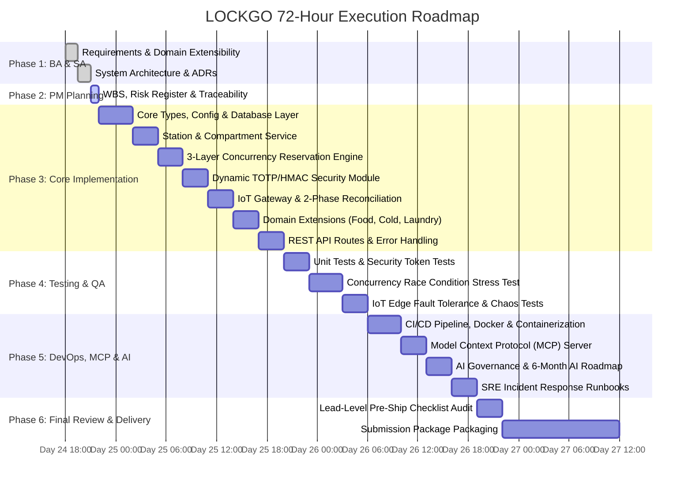

# LOCKGO — Project Execution Plan & Work Breakdown Structure (PM Phase)

> **Role:** Technical Project Manager & Delivery Lead  
> **Platform:** LOCKGO — Next-Gen Smart Locker Platform  
> **Author:** Napaporn Suttinarksombat (Koy) & Elena (Technical Assistant)  
> **Version:** 1.0.0 (Production Delivery Blueprint)

---

## 1. Project Charter & Delivery Strategy

### 1.1 Objective
Deliver a production-ready, highly resilient, and verifiable prototype of the LOCKGO Smart Locker Platform within the **72-hour assessment window**, demonstrating Senior AI Fullstack Platform Engineering mastery across System Design, Concurrency, Hardware/IoT Resilience, AI Agent Orchestration, and DevOps Governance.

### 1.2 Pragmatic Scope Management (Anti-Overengineering Principle)
In alignment with **Karpathy Law A1 (Simplicity First)** and **A4 (Design Laws)**:
- **Focus on Critical Value Paths:** Build deep, rock-solid implementations for the core concurrency engine, dynamic security tokens, IoT hardware simulation, and domain extension interfaces.
- **Pragmatic Boundary:** Rather than setting up 15 distinct Kubernetes clusters or raw hardware breadboards for a 72-hour assessment, implement a **clean Modular Monolith** in TypeScript with Docker Compose, embedded Redis/PostgreSQL, automated unit/integration/concurrency tests, and an IoT simulator verifying realistic edge edge cases.

---

## 2. Work Breakdown Structure (WBS) & MoSCoW Prioritization

```mermaid
mindmap
  root((LOCKGO Platform))
    Must Have (P0)
      Station & Compartment Registry
      3-Layer Concurrency Engine (0% Double Booking)
      Dynamic TOTP/HMAC QR & Single-Use Nonce
      IoT MQTT Protocol & 2-Phase Lock Reconciliation
      Append-Only Audit Logging
      Automated Unit & Concurrency Test Suite
    Should Have (P1)
      Multi-Domain Extension Engine (Food, Cold, Laundry, Parcel)
      Payment Webhook Reconciliation
      Docker Compose & Multi-Stage Dockerfile
      GitHub Actions CI/CD Pipeline
      Model Context Protocol (MCP) Server
    Could Have (P2)
      Web Admin Telemetry Dashboard (Vue/Nuxt)
      SRE Incident Runbooks & Alert Rules
      OpenTelemetry Distributed Tracing Config
    Won't Have This Iteration (Out of Scope)
      Full Mobile iOS/Android Binary Build
      Real Cellular 4G Hardware Modems (Mocked via IoT Daemon)
      Direct Bank Host-to-Host Settlement Integration
```

---

## 3. Detailed 72-Hour Calendar Execution Timeline



---

## 4. Requirements Traceability Matrix (RTM)

| Req ID | Requirement Description | Architecture Component | Implementation File | Verification Test | Status |
|---|---|---|---|---|---|
| **REQ-01** | Station Geolocation & Filter | `StationModule` | `src/modules/station/station.service.ts` | `tests/unit/station.test.ts` | Planned |
| **REQ-02** | 3-Layer Concurrency Locking | `ReservationModule` | `src/modules/reservation/reservation.service.ts` | `tests/concurrency/double-booking.test.ts` | Planned |
| **REQ-03** | Dynamic Rolling TOTP QR | `AccessSecurityModule`| `src/modules/security/dynamic-qr.service.ts` | `tests/security/dynamic-qr.test.ts` | Planned |
| **REQ-04** | Single-Use Nonce Burner | `AccessSecurityModule`| `src/modules/security/nonce-burner.ts` | `tests/security/nonce.test.ts` | Planned |
| **REQ-05** | IoT MQTT Unlock Protocol | `IoTGatewayModule` | `src/modules/iot/iot-gateway.service.ts` | `tests/iot/iot-gateway.test.ts` | Planned |
| **REQ-06** | 2-Phase Lock Reconciliation | `IoTGatewayModule` | `src/modules/iot/reconciliation.service.ts` | `tests/iot/reconciliation.test.ts` | Planned |
| **REQ-07** | Food Hygiene Timer (120m) | `DomainExtension` | `src/modules/domains/food.policy.ts` | `tests/unit/domain-policies.test.ts` | Planned |
| **REQ-08** | Cold Storage Temp Telemetry | `DomainExtension` | `src/modules/domains/cold.policy.ts` | `tests/unit/domain-policies.test.ts` | Planned |
| **REQ-09** | Immutable Audit Logging | `AuditModule` | `src/modules/audit/audit-logger.ts` | `tests/unit/audit.test.ts` | Planned |
| **REQ-10** | CI/CD Automated Gates | GitHub Actions | `.github/workflows/ci.yml` | GitHub Actions Pipeline Run | Planned |

---

## 5. Risk Register & Mitigation Strategy

| Risk ID | Risk Event | Impact | Likelihood | Mitigation Strategy | Owner |
|---|---|---|---|---|---|
| **RSK-01** | **Race condition double-booking under load spike** | Critical | High | 3-Layer Concurrency Defense: Redis Redlock (5s) + PostgreSQL `SELECT FOR UPDATE` + Partial Unique DB Constraint. | Lead SA / DEV |
| **RSK-02** | **Physical locker network disconnect during unlock** | High | High | Edge controller local SQLite buffer + MQTT QoS 1 + 2-phase lock state reconciliation with timeout fallback. | IoT / SRE Lead |
| **RSK-03** | **QR code screenshot sharing / replay attack** | High | Medium | Dynamic rotating HMAC-SHA256 tokens (30s window) + atomic single-use nonce consumption via Redis `SETNX`. | Security Lead |
| **RSK-04** | **Scope creep & over-engineering within 72h** | Medium | High | Strict MoSCoW prioritization: build clean modular TypeScript core with Docker Compose instead of complex K8s cluster. | PM Lead |
| **RSK-05** | **AI Agent hallucination or unauthorized mutation** | High | Medium | MCP tool least-privilege scoping + strict Human-in-the-Loop approval gates for schema & destructive mutations. | AI Platform Lead |

---

## 6. Definition of Done (DoD)

A feature or module is officially considered **"Done" (L4 Production Standard)** only when all following criteria are met:
1. **TypeScript Strict Typecheck:** 0 type errors with `tsc --noEmit`.
2. **Lint & Static Security Gate:** 0 ESLint warnings, dependency vulnerability check clean.
3. **Automated Test Coverage:**
   - 100% pass on Unit Tests.
   - 100% pass on Concurrency Race Condition stress tests (demonstrating 0% double booking).
   - 100% pass on Dynamic QR expiration and replay attack tests.
4. **Architectural Traceability:** Code matches ADR-001 through ADR-005 in `docs/DECISIONS.md`.
5. **Observability & Auditability:** Every mutating state change writes an immutable audit record and emits structured JSON logs.
6. **Containerization:** Clean build and execution via `docker compose up --build`.
