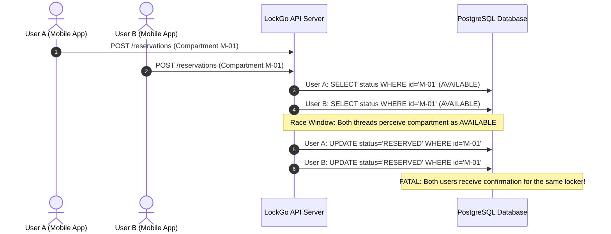
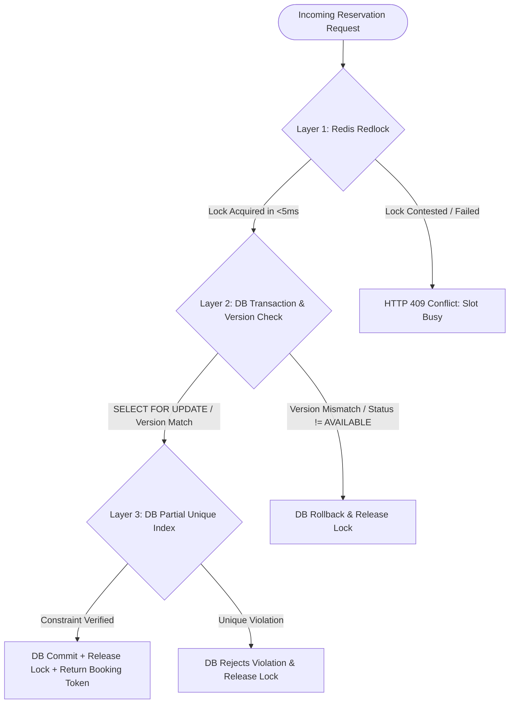
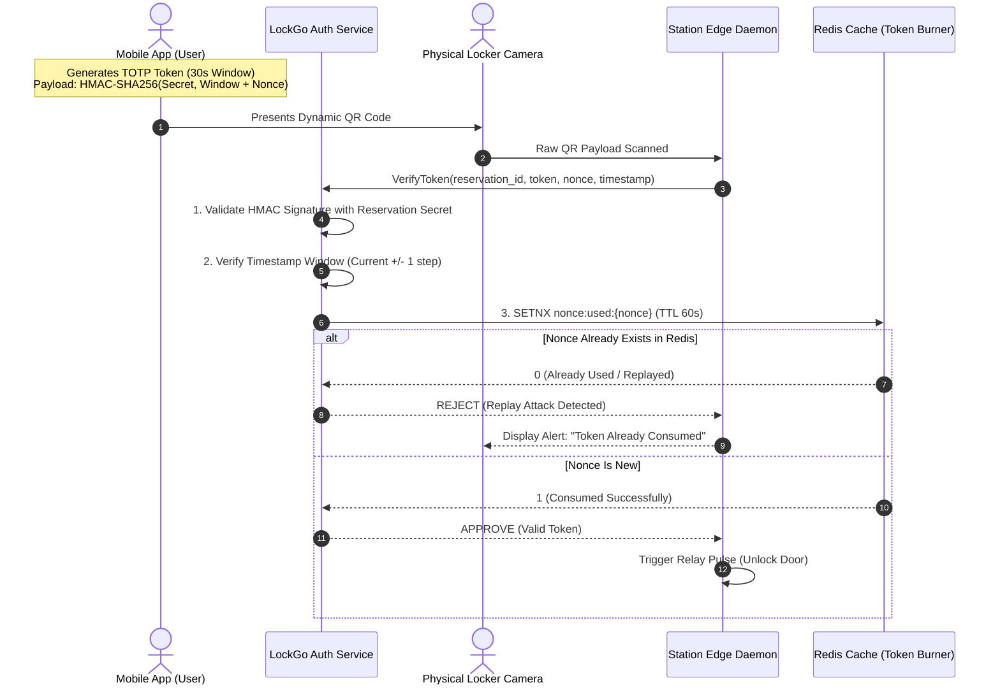

# LOCKGO — Concurrency Control & Dynamic Security Architecture

> **Assessment Section:** Concurrency Control, Race Condition Defense & Security Architecture  
> **Role:** Lead Platform Architect & Security Specialist  
> **Platform:** LOCKGO Smart Locker Platform  

---

## 1. Concurrency Control & Double Booking Prevention

### 1.1 The High-Demand Race Condition Problem
In high-traffic urban transit hubs (e.g., BTS Asoke or MRT Sukhumvit), multiple users frequently attempt to reserve the last remaining Medium (M) locker compartment simultaneously.

A naive implementation with standard `SELECT -> UPDATE` will create a classic **Time-of-Check to Time-of-Use (TOCTOU)** race condition:



---

### 1.2 The 3-Layer Defense-in-Depth Concurrency Architecture

To guarantee **0% Double-Booking** while maintaining sub-100ms P99 API response times, LockGo implements a **3-Layer Concurrency Defense**:



#### Layer 1: Distributed Memory Lock (Redis Redlock / Atomic Lua)
- **Mechanism:** Before touching the relational database, the API acquires a distributed lock on the specific compartment key `lock:compartment:{compartment_id}` with a 5000ms auto-expiry TTL.
- **Latency:** ~1-3ms.
- **Purpose:** Acts as a high-speed traffic filter, ensuring that out of 100 concurrent requests, only 1 request proceeds to the database layer at any millisecond.
- **Atomic Lua Release:**
```lua
if redis.call("get", KEYS[1]) == ARGV[1] then
    return redis.call("del", KEYS[1])
else
    return 0
end
```

#### Layer 2: ACID Relational Isolation (PostgreSQL `SELECT ... FOR UPDATE`)
- **Mechanism:** Within a `READ COMMITTED` or `REPEATABLE READ` transaction, query the compartment with row-level pessimistic locking:
```sql
SELECT id, station_id, status, version 
FROM compartments 
WHERE id = $1 AND status = 'AVAILABLE' 
FOR UPDATE;
```
- If no row is returned (already reserved by a prior committed transaction), transaction rolls back immediately and throws `CompartmentNotAvailableError`.

#### Layer 3: Physical Database Constraint (Partial Unique Index)
- **Mechanism:** Even if Redis crashes and application concurrency logic fails, the database engine physically rejects duplicate active allocations at the storage engine level.
```sql
CREATE UNIQUE INDEX idx_unique_active_compartment_reservation 
ON reservations (compartment_id) 
WHERE status IN ('PENDING', 'ACTIVE');
```

---

## 2. Dynamic QR Security & Anti-Screenshot Replay Defense

### 2.1 Threat Model
1. **Screenshot Sharing:** User A reserves a locker to store sensitive items or high-value documents. User A sends a screenshot of the QR code to an unauthorized person or has their photo gallery compromised.
2. **Replay Attacks:** An attacker captures the QR payload via network sniffing or camera recording and replays it at the physical scanner later.
3. **Brute Force Pickup PINs:** An attacker guesses a 4-digit PIN on the locker keypad.

---

### 2.2 Dynamic Rolling Token (TOTP / Signed HMAC-SHA256)



### 2.3 Cryptographic Token Structure

The dynamic QR code encodes a compact, URL-safe Base64 payload:

$$\text{QR Payload} = \text{ReservationID} \parallel \text{TimestampWindow} \parallel \text{Nonce} \parallel \text{HMAC-SHA256}(\text{Key}, \text{PayloadBody})$$

- **Time Step:** 30 seconds.
- **Drift Tolerance:** $\pm 1$ step (allows for up to 30 seconds of client/server clock discrepancy).
- **Single-Use Burner:** Each nonce is atomically burned in Redis with `SETNX nonce:{nonce} 1 EX 60`. If the return is 0, the token is flagged as a replay attack and blocked instantly.
