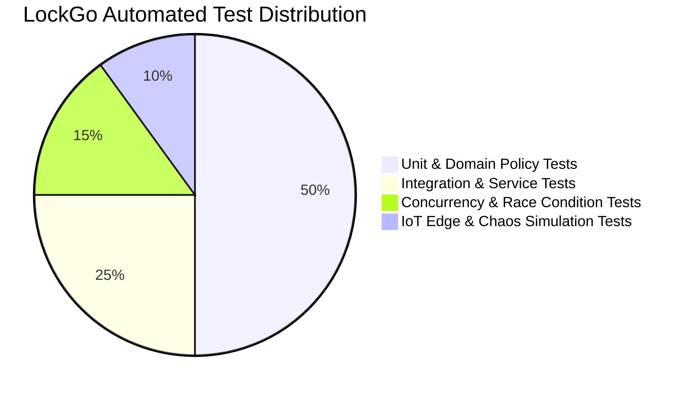
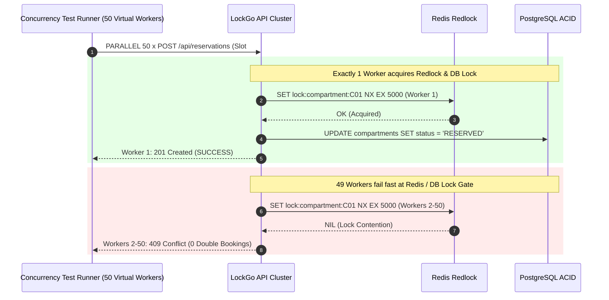
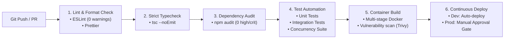

# LOCKGO — Testing & DevOps Strategy (QA & Platform Phase)

> **Role:** QA Lead & DevOps/Platform Engineer  
> **Platform:** LOCKGO — Next-Gen Smart Locker Platform  
> **Author:** Napaporn Suttinarksombat (Koy) & Elena (Technical Assistant)  
> **Version:** 1.0.0 (Production Quality & Infra Blueprint)

---

## 1. Test Strategy & The Testing Pyramid

To ensure 99.95% platform availability and 0% concurrency failures, LockGo adopts a **4-tier Testing Pyramid**:



### 1.1 Test Levels & Objectives
1. **Unit & Domain Policy Tests:** Validate business rules in complete isolation (e.g. Food 2-hour storage SLA expiration, Cold Locker temperature boundary validation, Dynamic TOTP generation math).
2. **Integration Tests:** Test database repositories with real PostgreSQL and Redis containers, verifying spatial queries and foreign key constraints.
3. **Concurrency Race Condition Stress Tests:** Fire 50-100 parallel asynchronous requests against a single available locker compartment to prove that exactly 1 request succeeds (HTTP 201) and all other concurrent requests fail gracefully (HTTP 409 Conflict) with 0% double booking.
4. **IoT Edge Fault Tolerance & Chaos Tests:** Simulate network disconnects, delayed MQTT sensor ACKs, and station reboot recovery scenarios.

---

## 2. Concurrency Race Condition Testing Specification



### Verification Criteria:
$$\text{Double Booking Rate} = \frac{\text{Successful Duplicate Reservations}}{\text{Total Concurrent Attempts}} = 0.000\%$$

---

## 3. Continuous Integration & Continuous Delivery (CI/CD Pipeline)



### Pipeline Quality Gates (`.github/workflows/ci.yml`):
- **Gate 1:** `npm run lint` — Zero ESLint errors or unhandled promises.
- **Gate 2:** `npm run type-check` — Zero TypeScript type errors with `strict: true`.
- **Gate 3:** `npm audit --audit-level=high` — Zero high/critical CVE vulnerabilities.
- **Gate 4:** `npm run test` — 100% test pass rate with coverage threshold ≥ 85%.
- **Gate 5:** `docker build --target production` — Immutable container image packaging.

---

## 4. Multi-Stage Containerization Architecture

```dockerfile
# Stage 1: Build & TypeScript Compilation
FROM node:22-alpine AS builder
WORKDIR /app
COPY package*.json tsconfig.json ./
RUN npm ci
COPY src ./src
RUN npm run build

# Stage 2: Production Minimal Runtime (Distroless / Alpine Non-Root)
FROM node:22-alpine AS production
WORKDIR /app
ENV NODE_ENV=production
RUN addgroup -S appgroup && adduser -S appuser -G appgroup
COPY package*.json ./
RUN npm ci --only=production && npm cache clean --force
COPY --from=builder /app/dist ./dist
USER appuser
EXPOSE 3000
HEALTHCHECK --interval=15s --timeout=3s --retries=3 \
  CMD wget --no-verbose --tries=1 --spider http://localhost:3000/api/health || exit 1
CMD ["node", "dist/index.js"]
```

---

## 5. Observability, Tracing & Metrics Architecture

| Observability Pillar | Technology | Implementation Detail | Alert Threshold |
|---|---|---|---|
| **Metrics** | Prometheus | Station online count, compartment occupancy rate, reservation latency histogram | P99 latency > 250ms for 5 mins |
| **Distributed Tracing** | OpenTelemetry + Jaeger | Trace context propagation from HTTP headers (`traceparent`) to MQTT messages | Span error rate > 1% |
| **Structured Logging** | Pino -> Grafana Loki | JSON-formatted stdout with `requestId`, `stationId`, `actorId`, `action` | Error log burst > 20/min |
| **Error APM** | Sentry | Full stack trace capture with source maps & environment tags | Unhandled exception count > 0 |
| **Station Heartbeat** | In-Memory Healthcheck | Station ping every 30s over MQTT | Missing 3 consecutive heartbeats (90s) triggers `STATION_OFFLINE` |
