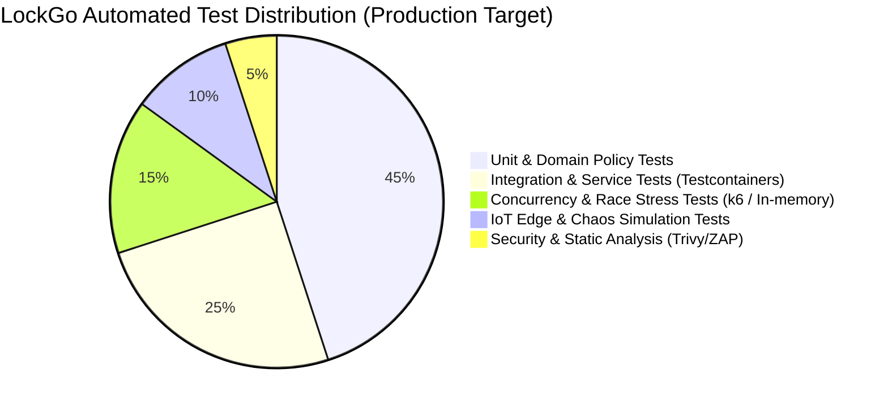
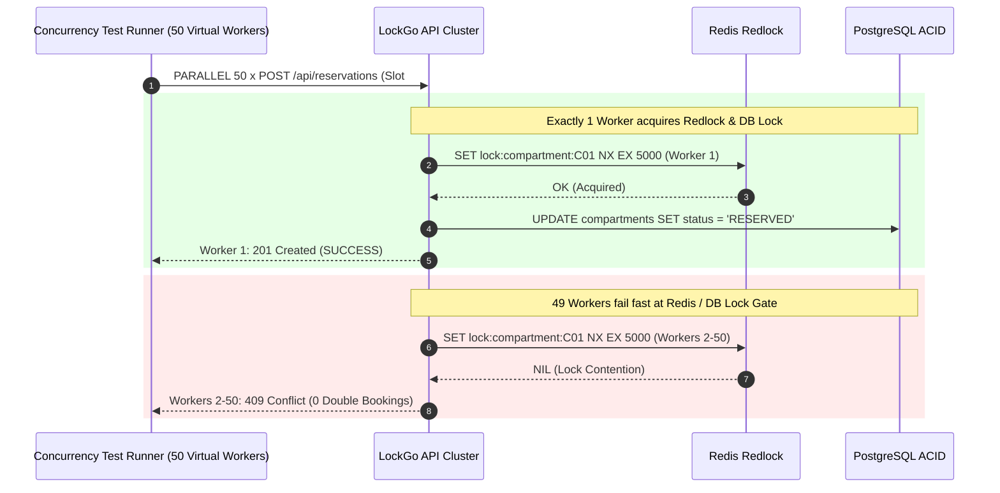
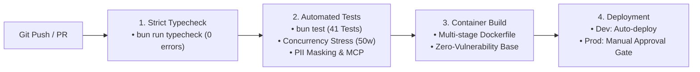

# LOCKGO — Testing & DevOps Strategy (QA & Platform Phase)

> **Role:** QA Lead & DevOps/Platform Engineer  
> **Platform:** LOCKGO — Next-Gen Smart Locker Platform  
> **Author:** Napaporn Suttinarksombat (Koy) & Elena (Technical Assistant)  
> **Version:** 1.0.0 (Production Quality & Infra Blueprint)

---

## 1. Testing Strategy & The Testing Pyramid (Scope Transparency)

เพื่อความโปร่งใสทางวิศวกรรม (Scope Transparency) ระบบทดสอบของ LOCKGO แบ่งออกเป็น 2 มิติ:
1. **ชุดทดสอบประเมินผลในเครื่อง (72-Hour Assessment In-Memory Harness):** รันบน Bun Test Runner ทดสอบตรรกะ Concurrency (50 workers), Dynamic QR TOTP, Two-Phase Payment, Double-Entry Ledger, PII Masking, และ JSON-RPC MCP Server
2. **พิมพ์เขียวระบบทดสอบบนโปรดักชัน (Enterprise Production Testing Blueprint):** แผนการทดสอบแบบ End-to-End บน Testcontainers, k6 Load Testing, และ Playwright E2E



### 1.1 Test Levels & Objectives

| Test Tier | Scope & Tooling (Assessment Harness) | Production Enterprise Blueprint | Target Criteria |
|---|---|---|---|
| **Tier 1: Unit & Policy Tests** | Bun Test (`tests/unit/`) — ทดสอบ Food 120m SLA, Cold Storage 2-8°C, Laundry Daily Rates, Parcel Multipliers | Isolated pure functions & Domain Entities | 100% Pass, Code Coverage ≥ 85% |
| **Tier 2: Security & Privacy Tests** | `tests/security/` & `tests/unit/audit-masking.test.ts` — ทดสอบ Dynamic TOTP 30s, TimingSafeEqual HMAC, Nonce Burner, Emergency PIN 3-strike, PDPA PII Regex Masking | OWASP ZAP API Scanning + HashiCorp Vault Hardware Security Module (HSM) | 0 CVEs, Zero Timing Attack Discrepancy |
| **Tier 3: Concurrency Race Condition** | `tests/concurrency/` — Dispatch 50 concurrent async workers แย่งจอง 1 slot เดียวกันใน Event Loop Microtask | k6 Distributed Load Generator (1,000 VUs) ยิงชน Redis Redlock + PostgreSQL Cluster | Double Booking Rate = 0.000% |
| **Tier 4: IoT & State Reconciliation** | `tests/iot/` — จำลอง MQTT QoS 1 direct ACK, Jammed Solenoid Auto-Refund, และ Fallback Sensor Polling | Real Hardware Loop (ESP32 / Modbus RS-485 Breadboard + EMQX Test Broker) | Desync MTTR < 5s |
| **Tier 5: AI & MCP Governance** | `tests/mcp/` — ทดสอบ JSON-RPC 2.0 Stdio Transport (`initialize`, `tools/list`, `tools/call`) และ HMAC Signature Gate | Multi-Agent Evaluation Harness (Cursor / AGY Evaluation Benchmark) | 100% Gate Enforcement on Destructive Actions |

---

## 2. Concurrency Race Condition Testing Specification



### Verification Criteria:
$$\text{Double Booking Rate} = \frac{\text{Successful Duplicate Reservations}}{\text{Total Concurrent Attempts}} = 0.000\%$$

---

## 3. Continuous Integration & Continuous Delivery (CI/CD Pipeline)



### Pipeline Quality Gates (`.github/workflows/ci.yml`):
- **Gate 1 (Strict Static Types):** `bun run typecheck` — ตรวจจับ Type Mismatches ด้วย TypeScript Compiler (`strict: true`, 0 errors).
- **Gate 2 (Automated Test Suites):** `bun test` — รันชุดทดสอบครบ 41 เคส (Unit, Concurrency, IoT, Security, Payment, PII Masking, MCP).
- **Gate 3 (Production Packaging):** `docker build -t lockgo-platform:latest .` — Build คอนเทนเนอร์ระดับ Production.

---

## 4. Multi-Stage Containerization Architecture

```dockerfile
# Stage 1: Build & TypeScript Compilation
FROM oven/bun:1.3.14-alpine AS builder
WORKDIR /app
COPY package*.json bun.lock tsconfig.json ./
RUN bun install --frozen-lockfile
COPY src ./src
RUN bun build src/index.ts --outdir dist --target bun

# Stage 2: Production Minimal Runtime (Alpine Non-Root)
FROM oven/bun:1.3.14-alpine AS production
WORKDIR /app
ENV NODE_ENV=production
RUN addgroup -S appgroup && adduser -S appuser -G appgroup
COPY package*.json bun.lock ./
RUN bun install --production --frozen-lockfile
COPY --from=builder /app/dist ./dist
USER appuser
EXPOSE 3000
HEALTHCHECK --interval=15s --timeout=3s --retries=3 \
  CMD wget --no-verbose --tries=1 --spider http://localhost:3000/api/health || exit 1
CMD ["bun", "run", "dist/index.js"]
```

---

## 5. Observability, Tracing & Metrics Architecture

| Observability Pillar | Technology | Implementation Detail | Alert Threshold |
|---|---|---|---|
| **Metrics** | Prometheus | Station online count, compartment occupancy rate, reservation latency histogram | P99 latency > 250ms for 5 mins |
| **Distributed Tracing** | OpenTelemetry + Jaeger | Trace context propagation from HTTP headers (`traceparent`) to MQTT messages | Span error rate > 1% |
| **Structured Logging** | Pino -> Grafana Loki | JSON-formatted stdout with `requestId`, `stationId`, `actorId`, `action` พร้อมทำ PII Masking | Error log burst > 20/min |
| **Error APM** | Sentry | Full stack trace capture with source maps & environment tags | Unhandled exception count > 0 |
| **Station Heartbeat** | In-Memory Healthcheck | Station ping every 30s over MQTT | Missing 3 consecutive heartbeats (90s) triggers `STATION_OFFLINE` |
