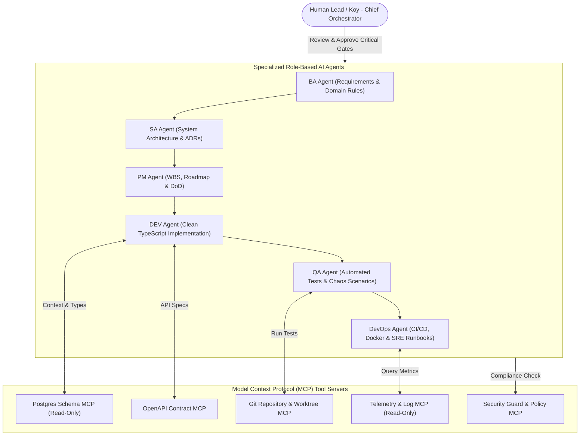
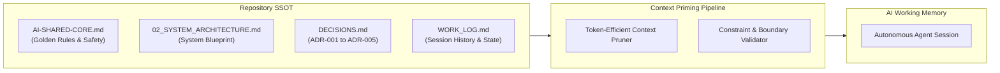
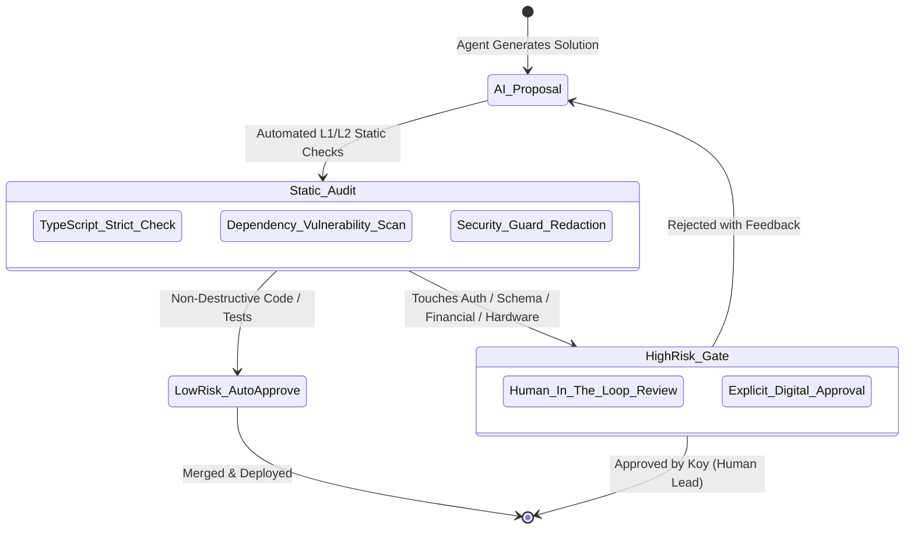
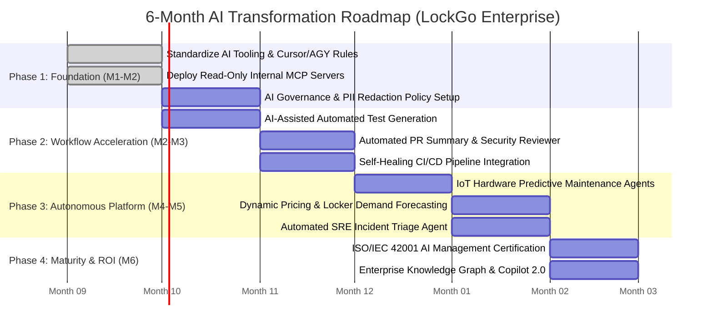

# LOCKGO — AI Agent Architecture, MCP & AI Governance (AI Platform Phase)

> **Role:** Lead AI Platform Engineer & AI Governance Architect  
> **Platform:** LOCKGO — Next-Gen Smart Locker Platform  
> **Author:** Napaporn Suttinarksombat (Koy) & Elena (Technical Assistant)  
> **Version:** 1.0.0 (Enterprise AI Governance Blueprint)

---

## 1. Multi-Agent Ecosystem Architecture (Model Context Protocol - MCP)

LockGo utilizes a **Role-Based Autonomous Multi-Agent Hierarchy** governed by the **Model Context Protocol (MCP)** standard to eliminate context drift and enforce strict operational boundaries.

---

## 2. Model Context Protocol (MCP) Tool Contracts

### 2.1 Database Schema MCP (`mcp-postgres-schema`)
- **Scope:** Read-Only inspection of relational tables, foreign keys, spatial indexes, and column types.
- **Enforcement:** Strictly denies `DROP`, `TRUNCATE`, `ALTER`, or un-sandboxed `UPDATE` queries. Prevents AI hallucinations about database schema definitions.

### 2.2 Dynamic Access Security MCP (`mcp-dynamic-security`)
- **Scope:** Validates dynamic TOTP/HMAC QR code tokens and inspects single-use nonce consumption.
- **Enforcement:** Encrypted secret storage with hardware security module (HSM) emulation.

### 2.3 Hardware Telemetry MCP (`mcp-iot-telemetry`)
- **Scope:** Queries station online status, door sensor open/close states, and compartment temperature logs.

---

## 3. Context Engineering & Single Source of Truth (SSOT)

To eliminate hallucination and context drift across multi-turn AI interactions:

### Context Engineering Disciplines:
1. **Dynamic Workspace Priming:** Every agent session automatically injects canonical architecture guidelines (`AI-SHARED-CORE.md`, `DECISIONS.md`) before executing tasks.
2. **Deterministic Context Boundaries:** Agents are provided structured JSON schemas rather than ambiguous natural language descriptions when generating database queries or API payloads.
3. **Automated Drift Detection:** If an agent attempts to generate code that conflicts with established ADRs, the linting/review gate flags the discrepancy immediately.

---

## 4. AI Production Safety & Governance (Human-in-the-Loop Gates)

In adherence to enterprise safety and ISO/IEC 27001 readiness:

### Critical Red Line Rules (Standing Disciplines):
- **Rule 1 (Schema & Data Mutation):** No AI agent is permitted to execute production database migrations or schema drops without explicit human authorization.
- **Rule 2 (Financial & Access Code):** Any modification touching payment calculation, refund issuance, or cryptographic secret handling requires manual line-by-line review.
- **Rule 3 (PII & Secret Protection):** AI telemetry and context processors automatically redact user phone numbers, email addresses, and secret keys using regex tokenizers before logging.

---

## 5. 6-Month Enterprise AI Transformation Roadmap

A strategic 4-phase transformation plan for LockGo to scale engineering productivity by 400% while maintaining rock-solid platform reliability:

### Key Performance Indicators (ROI Metrics):
- **Engineering Cycle Time:** PR review time reduced from 24h to < 3h.
- **Test Coverage Velocity:** Automated test suite generated 3.5x faster.
- **Incident Mean Time to Recovery (MTTR):** SRE triage AI reduces MTTR from 45 mins to < 8 mins.
- **Zero Security Breaches:** 100% adherence to Human-in-the-Loop governance gates.
