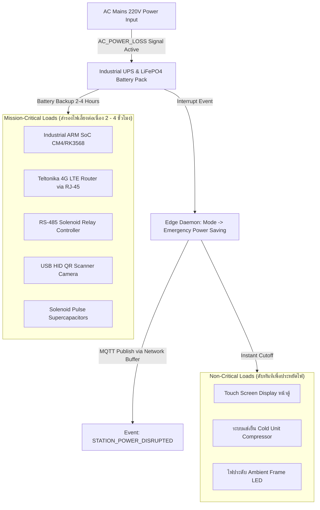
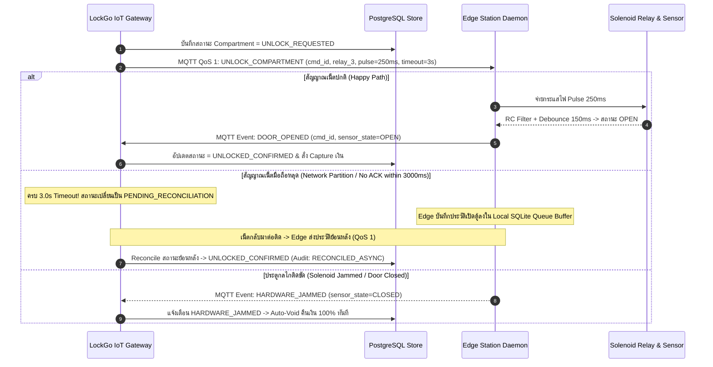

# LOCKGO — IoT Hardware Integration, Power Resilience, OTA Strategy & 2-Phase Lock Reconciliation

> **Role:** Lead IoT & Embedded Systems Architect  
> **Platform:** LOCKGO Smart Locker Platform  
> **Author:** Napaporn Suttinarksombat (Koy) & Elena (Technical Assistant)  
> **Version:** 1.8.0 (Comprehensive Industrial Hardware, OTA Blue/Green & Dual-Partition A/B Architecture)

---

## 1. Hardware Architecture & Power Outage Resilience (ระบบสำรองไฟ 2-4 ชม.)

เมื่อเกิดเหตุไฟฟ้าดับ (สัญญาณ `AC_POWER_LOSS` = Active จาก UPS / Dry Contact Relay):
1. **Emergency Power Saving Mode:** ตัว Edge Daemon จะสลับสถานะเข้าสู่โหมดประหยัดพลังงานฉุกเฉินทันที
2. **Instant Load Shedding:**
   - **หยุดการทำงานของ Screen Display หน้าตู้ทันที** (ดับจอสัมผัส/จอโฆษณา)
   - **ปิดระบบทำความเย็น (Cold Unit Compressor) ทันที** เพื่อตัดโหลดกินไฟหลัก (ลดจาก ~150W เหลือ < 10W)
3. **Event Dispatch:** ส่ง Event `STATION_POWER_DISRUPTED` ไปที่ Cloud Gateway ผ่าน **Network Buffer** (หากเน็ตตัดจะเข้าคิวใน Local SQLite ทันที)
4. **Mission-Critical Power Reservation:** สำรองพลังงานไฟจากแบตเตอรี่ LiFePO4 ให้เฉพาะ **ระบบสื่อสาร (Industrial 4G Router) และ Relay Controller / Solenoid Board** ให้อยู่ได้อีกอย่างน้อย **2 - 4 ชั่วโมง** เพื่อรองรับผู้ใช้ที่กำลังเดินทางมาเอาของออก ณ ขณะนั้น

---

## 2. Hybrid Over-The-Air (OTA) Update Strategy (ป้องกันตู้กลายเป็น Brick 100%)

เพื่อบริหารจัดการตู้ล็อกเกอร์กว่า 10,000 จุดทั่วประเทศ ระบบแบ่งสถาปัตยกรรมการอัปเดตเป็น **2 เลเยอร์แบบ Hybrid**:

```mermaid
flowchart TB
    subgraph Layer1 ["Layer 1: Application & Daemon OTA (95% ของการอัปเดต)"]
        DockerReg["Docker Container Registry"]
        PullImage["Docker Image Pull (New Version)"]
        BlueGreen["Blue/Green Container Deployment on Edge"]
        LocalLoopback["Health Check via Local Loopback (127.0.0.1:8080/health)"]
        SwitchTraffic["Switch Traffic & Terminate Old Container (<10s, No Reboot)"]
        
        DockerReg --> PullImage --> BlueGreen --> LocalLoopback --> SwitchTraffic
    end

    subgraph Layer2 ["Layer 2: Core OS / Kernel / Firmware OTA (Dual-Partition A/B)"]
        Mender["RAUC / Mender.io OTA Server"]
        PartitionB["Write New OS to Inactive Partition B"]
        SetBootTarget["Set Next Boot Target = Partition B"]
        Reboot["Reboot Board"]
        WatchdogCheck{"Hardware Watchdog & Service Check (3 mins)"}
        CommitB["Mark Partition B as Active & Healthy"]
        RollbackA["WDT Hardware Reset -> Auto-Rollback to Partition A"]

        Mender --> PartitionB --> SetBootTarget --> Reboot --> WatchdogCheck
        WatchdogCheck -->|Pass| CommitB
        WatchdogCheck -->|Fail / Crash| RollbackA
    end
```

### 2.1 Layer 1: Edge Daemon & Application Update (Blue/Green Container)
- อัปเดตผ่าน **Docker Container Registry Pull**
- รัน Container เวอร์ชั่นใหม่คู่ขนาน ทำ Health Check ผ่าน Local Loopback หากผ่านจึงสลับ Traffic ภายใน **10 วินาที โดยไม่ต้องรีบูตตู้**

### 2.2 Layer 2: Core OS / Kernel / Firmware Update (Dual-Partition A/B)
- ใช้ระบบ **Dual-Partition A/B (RAUC / Mender.io)** เขียน OS ลงใน Partition B ที่ไม่ได้ใช้งาน
- **Hardware Watchdog Auto-Rollback:** หาก Partition B รันระบบไม่ผ่านภายใน **3 นาที** หลังรีบูต ชิป Hardware Watchdog Timer (WDT) จะสั่ง Reset บอร์ดและสลับกลับมาบูต Partition A เดิมทันที การันตีตู้ไม่ดับถาวร (0% Brick Guarantee)

---

## 3. Cellular Network Architecture & CGNAT Outbound-Only Engine

- **Industrial Router via RJ-45:** ใช้ Teltonika 4G LTE Router ต่อผ่านสายแลน Ethernet RJ-45 จัดการ Network Stack ผ่าน Linux OS `netplan`
- **mTLS Hardware Security Element:** ติดตั้งชิป **Microchip ATECC608A / TPM 2.0** ผ่าน I2C เก็บ Private Key ใน Secure Enclave
- **MQTT Keep-Alive (30 วินาที):** ส่ง `PINGREQ` ทุก 30 วินาที เลี้ยง State Table ใน Telco CGNAT Gateway
- **Persistent Session (`cleanSession = false`):** เก็บตกคำสั่งค้างท่อด้วย QoS 1 เมื่อเน็ตหลุดชั่วคราว
- **Jittered Exponential Backoff:** Reconnect ด้วยสูตร $(2^n \pm \text{jitter})$ (1s, 2s, 4s, 8s, สูงสุด 30s)

---

## 4. Industrial Hardware Specifications & Sensor Debouncing

### 4.1 Dual-Tier Door Sensor Debounce (Hardware RC + Software Filter)
- **Tier 1 (Hardware RC Filter):** $R = 10\text{k}\Omega, C = 100\text{nF}$ ($\tau = 1\text{ms}$) กรองความถี่สูงหน้าขา Input
- **Tier 2 (Software Debounce Filter):** Sampling Rate ที่ **50ms** ต้องได้ค่าสถานะเดียวกันต่อเนื่องกัน **3 Samples (150ms Stable Window)** จึงจะ Trigger State Transition (`DOOR_CLOSED` / `DOOR_OPENED`)

### 4.2 Station Barcode/QR Scanner Interface (USB HID Mode)
- สแกนเนอร์หน้าตู้ทำงานแบบ **USB HID (Keyboard Emulation)** ส่งข้อมูลผ่าน `/dev/input/event*` ในฟอร์แมต: `[RAW_DATA_STRING] + \r\n` (CRLF) โดย Edge Daemon ใช้ Read Buffer รอตัดที่ตัว `\n` เพื่อนำไปตรวจ Nonce ทันที ไม่เปลือง CPU ทำ Video Processing

### 4.3 Dual-Point Cold Storage Telemetry
- ติดตั้ง Dallas DS18B20 (1-Wire) ตู้ละ 2 จุด (จุดบน-ล่าง) อ่านค่าทุก 30s แจ้งเตือนเมื่ออุณหภูมิสูงเกิน 8.0°C นานเกิน 5 นาที (10 รอบ)

---

## 5. Two-Phase Lock State Reconciliation Protocol

