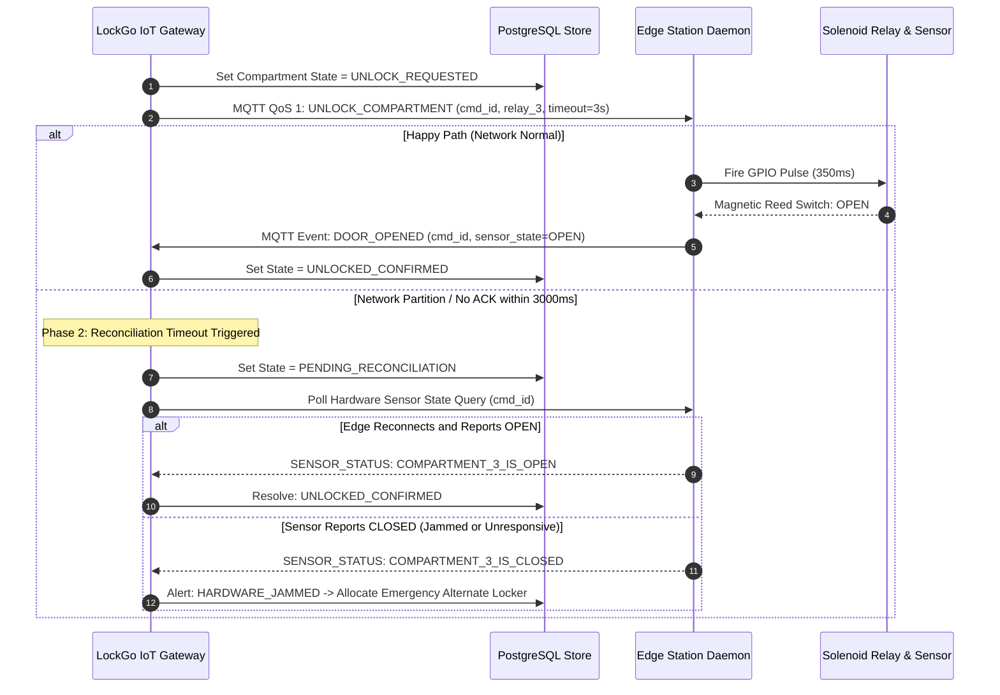

# LOCKGO — IoT Hardware Integration & 2-Phase Lock State Reconciliation

> **Assessment Section:** IoT Protocol, Hardware Controller Resilience & Offline Fault-Tolerance  
> **Role:** Lead IoT Platform Architect & Embedded Systems Partner  
> **Platform:** LOCKGO Smart Locker Platform  

---

## 1. IoT Hardware & Communication Architecture

Physical locker stations operate in hostile, unpredictable network environments (underground subway tunnels, shopping mall basements, 4G cellular latency spikes, intermittent Wi-Fi drops).

```mermaid
flowchart LR
    subgraph Cloud ["LOCKGO Cloud Backend"]
        Broker["MQTT Broker (EMQX Cluster)"]
        IoTGateway["IoT Gateway Service"]
        Reconciliation["2-Phase Lock Reconciliation Engine"]
    end

    subgraph Station ["Physical Locker Station (Edge)"]
        EdgeDaemon["Station Edge Controller Daemon (Linux/ARM)"]
        SQLiteBuffer[("Local SQLite Queue Buffer")]
        RelayController["RS-485 / Modbus Relay Board"]
        DoorSensors["Magnetic Door Reed Switches"]
        ThermalSensors["Cold Locker Temperature Probes"]
    end

    IoTGateway <-->|MQTT over mTLS (QoS 1)| Broker
    Broker <-->|Persistent TLS Connection| EdgeDaemon
    EdgeDaemon <--> SQLiteBuffer
    EdgeDaemon -->|GPIO / Relay Pulse| RelayController
    DoorSensors -->|Digital Input| EdgeDaemon
    ThermalSensors -->|I2C / 1-Wire| EdgeDaemon
```

---

## 2. Asynchronous Command Flow with Correlation IDs

Traditional synchronous RPC over IoT leads to cascading connection timeouts. LockGo uses an **Asynchronous Event-Driven Command-Query Segregation (CQS)** model:

### 2.1 MQTT Topic Topology
- **Command Topic (Cloud -> Station):** `lockgo/stations/{station_id}/commands`
- **Feedback Event Topic (Station -> Cloud):** `lockgo/stations/{station_id}/events`
- **Telemetry Stream Topic (Station -> Cloud):** `lockgo/stations/{station_id}/telemetry`
- **Edge Heartbeat Topic:** `lockgo/stations/{station_id}/heartbeat`

### 2.2 Unlock Command Payload Specification
```json
{
  "command_id": "cmd_8f43a9b2-10c5-4921-b389-91823746a512",
  "action": "UNLOCK_COMPARTMENT",
  "compartment_id": "comp_m01",
  "relay_index": 3,
  "pulse_duration_ms": 350,
  "issued_at": 1756034100000,
  "ttl_ms": 10000,
  "correlation_token": "res_84719284"
}
```

---

## 3. Two-Phase Lock State Reconciliation Protocol

When an unlock command is dispatched, physical anomalies can occur:
1. Relay fires, but physical door is mechanically jammed.
2. 4G cellular drops immediately after solenoid pulse, so Cloud never receives ACK.
3. User opens door, closes it, but sensor bounces.



---

## 4. Edge Offline Fault-Tolerance

If the station completely loses internet connectivity during active use:
1. **Local Dynamic Token Verification:** The Edge controller caches the encrypted station root key and dynamic TOTP validator algorithm locally.
2. **Offline Unlock Execution:** When a user presents a dynamic QR code on the physical scanner while offline, the edge daemon verifies HMAC validity and triggers the unlock relay locally.
3. **Local SQLite Event Buffer:** The unlock event is written to local edge storage (`/var/lockgo/events.db`).
4. **Replay-Safe Sync upon Reconnection:** Once network connectivity restores, buffered events are flushed to Cloud with original hardware sensor timestamps.
