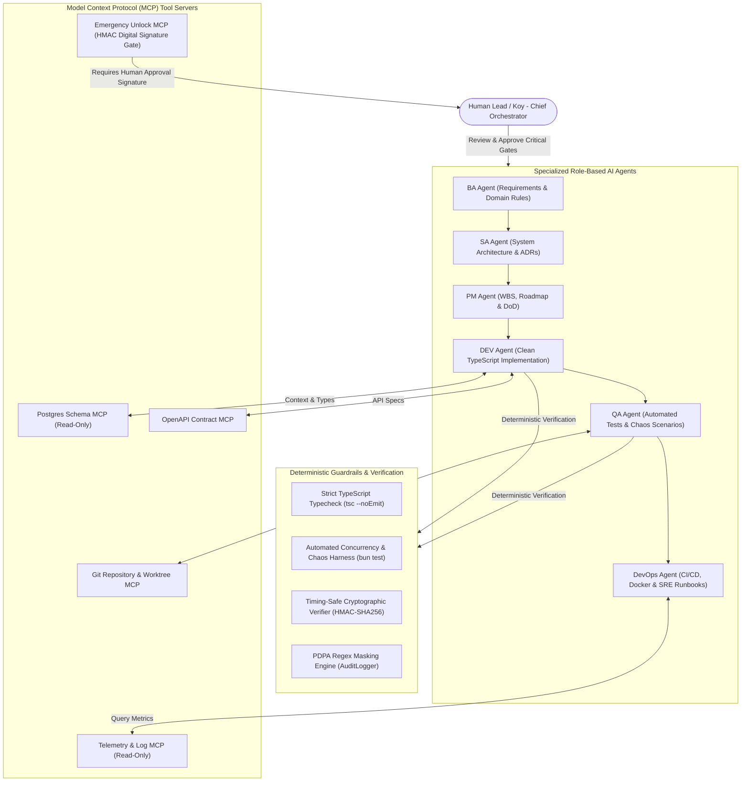
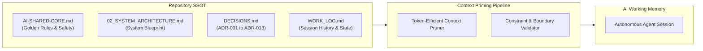
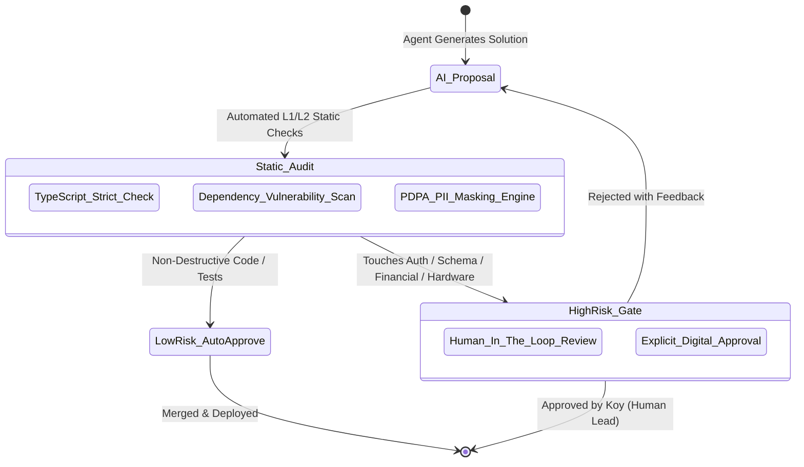
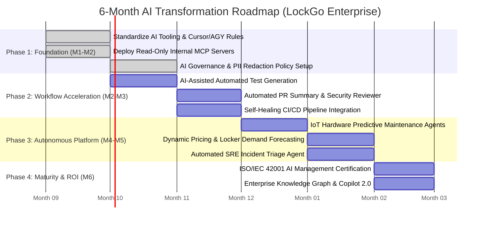

# LOCKGO — AI Agent Architecture, MCP & AI Governance (AI Platform Phase)

> **Role:** Lead AI Platform Engineer & AI Governance Architect  
> **Platform:** LOCKGO — Next-Gen Smart Locker Platform  
> **Author:** Napaporn Suttinarksombat (Koy) & Elena (Technical Assistant)  
> **Version:** 1.0.0 (Enterprise AI Governance Blueprint)

---

## 1. Multi-Agent Ecosystem Architecture (Model Context Protocol - MCP)

LockGo utilizes a **Role-Based Autonomous Multi-Agent Hierarchy** governed by the **Model Context Protocol (MCP)** standard to eliminate context drift and enforce strict operational boundaries.

---

## 2. Agent Workflow Input/Output & Handoff Specification

ตารางแสดงข้อกำหนดการรับส่งข้อมูล (Input / Output / Artifacts / Handoff Trigger) ระหว่าง AI Subagents แต่ละบทบาท:

| Agent Role | Input (สิ่งที่ได้รับ) | Output / Deliverable (สิ่งที่ส่งมอบ) | Canonical Artifact | Handoff Trigger (เงื่อนไขส่งต่องาน) |
|---|---|---|---|---|
| **1. BA Agent** (Business Analyst) | User Requirements, Thai Regulations (PDPA, ธปท., ปปง., มอก., กสทช.), Business Constraints | Requirement Traceability Matrix (RTM), Domain Policy SLA Matrix (Food 120m, Cold 2-8°C) | `docs/01_BUSINESS_AND_REQUIREMENTS.md` | RTM ครบ 23 หัวข้อ และผ่าน Legal Checklist 100% |
| **2. SA Agent** (System Architect) | `01_BUSINESS_AND_REQUIREMENTS.md`, Hardware Specs, Concurrency Targets | C4 Architecture Diagrams, PostgreSQL 16 ERD, 3-Layer Concurrency Design, Architectural Decision Records | `docs/02_SYSTEM_ARCHITECTURE.md` `docs/DECISIONS.md` (ADR-001 to ADR-013) | C4 Diagrams ถูกต้องตาม Mermaid Syntax และมี ADR รองรับทุก Trade-off |
| **3. PM Agent** (Project Manager) | System Architecture, ADRs, Project Deadline (72h) | Work Breakdown Structure (WBS), RTM Coverage Map, Milestone Plan, Scope Transparency Matrix | `docs/03_PROJECT_PLAN_AND_WBS.md` `docs/WORK_LOG.md` | จัดสรรงานลงสปรินต์ครบ และระบุ Implemented vs Designed ชัดเจน |
| **4. DEV Agent** (Software Engineer) | WBS, Architecture ADRs, OpenAPI Contracts, DB Schema | TypeScript Production Source Code (Modular Monolith, Concurrency Engine, Dynamic QR, Payment, MCP Server) | `src/` (Core, Modules, API, MCP) | ผ่าน `tsc --noEmit` ได้ 0 Type Errors และไม่มี Any Types |
| **5. QA Agent** (Quality Assurance) | Source Code, Concurrency Specifications, Edge Failure Scenarios | Automated Test Suites (Unit, Concurrency Race 50 workers, IoT 2-Phase Reconciliation, PII Masking, Payment, MCP) | `tests/` (Unit, Concurrency, IoT, Security, MCP) | รัน `bun test` ผ่าน 100% Green และ Double Booking Rate = 0.000% |
| **6. DevOps & SRE Agent** (Site Reliability) | Container Requirements, Infrastructure Topology, Failure Scenarios | Multi-Stage Dockerfile, Docker Compose, GitHub Actions CI Pipeline, Incident Runbooks (Playbooks 1-7) | `docs/04_TESTING_AND_DEVOPS_STRATEGY.md` `docs/07_SRE_INCIDENT_RUNBOOK.md` `.github/workflows/ci.yml` | Container Build สำเร็จ และมี Runbook ครอบคลุมวิกฤติทุกระดับ |

---

## 3. Rationale: ทำไม Security & Code-Review จึงไม่ถูกแยกเป็น Autonomous LLM Agent

ในการออกแบบระดับ Enterprise AI Architecture ของ LOCKGO เราตัดสินใจ **ไม่แยก Security Agent และ Code-Review Agent ออกเป็น Autonomous LLM Agent อิสระ** ด้วยเหตุผลเชิงวิศวกรรมดังนี้:

1. **Non-Determinism & Hallucination Risk:**
   - LLM มีลักษณะ Stochastic (สุ่มความน่าจะเป็น) ไม่สามารถรับประกันได้ 100% ว่าจะตรวจพบช่องโหว่ความปลอดภัยทุกครั้ง (เช่น Timing Attack บน `!==` หรือ Nonce Replay) การพึ่งพา LLM ตัวเดียวเป็น Security Gate จึงสร้าง "ภาพลวงตาของความปลอดภัย" (False Sense of Security)
2. **Deterministic Guardrails เหนือกว่า LLM ในด้านความมั่นคงปลอดภัย:**
   - ระบบความปลอดภัยของ LOCKGO ถูกออกแบบให้เป็น **Deterministic Platform Guardrails** ในระดับโค้ดและไปป์ไลน์:
     - **Strict Static Typecheck (`tsc --noEmit`):** ตรวจสอบ Type Invariant และ Null Safety ระดับคอมไพเลอร์
     - **Cryptographic Primitives:** ใช้ `crypto.timingSafeEqual`, HMAC-SHA256, และ Redis Atomic `SETNX` (Nonce Burner) ระดับ Kernel Memory
     - **Automated Chaos Harness:** Stress Test 50 workers วิ่งจริงใน Event Loop ตรวจสอบ Race Condition เชิงประจักษ์
3. **Human-in-the-Loop Cryptographic Approval Gate (ADR-005):**
   - คำสั่งฉุกเฉินระดับวิกฤติ (เช่น Emergency Unlock, Schema Migration, Direct Void) บังคับใช้ **HMAC-SHA256 Digital Signature จากมนุษย์ผู้มีอำนาจ** โดยไม่ยอมให้ AI Agent ตัดสินใจเองโดยลำพัง

---

## 4. Model Context Protocol (MCP) Tool Contracts (JSON-RPC 2.0 Stdio)

LOCKGO พัฒนา MCP Server ตามมาตรฐาน **MCP Protocol Spec 2024-11-05 ผ่าน JSON-RPC 2.0 Stdio Transport** ใน [`src/mcp/server.ts`](file:///C:/Projects/personal/lockgo-assessment/src/mcp/server.ts):

### 4.1 `get_station_health` (Read-Only)
- **Scope:** ดึงข้อมูล Telemetry สถานี, สถานะเซ็นเซอร์ประตู, จำนวนช่องว่าง และการเชื่อมต่อเครือข่าย

### 4.2 `query_compartment_availability` (Read-Only)
- **Scope:** ค้นหาช่องล็อกเกอร์ที่ว่างแบบเรียลไทม์ พร้อมตัวกรองขนาดช่อง (S/M/L/XL) และประเภทการใช้งาน

### 4.3 `diagnose_lock_reconciliation_incident` (Read-Only Observability)
- **Scope:** ดึงประวัติ Audit Trail และสถานะเซ็นเซอร์ย้อนหลังเพื่อวิเคราะห์ปัญหากลอนโซลินอยด์ติดขัด

### 4.4 `trigger_emergency_door_unlock` (Action with Human Approval Gate)
- **Scope:** ปลดล็อกกลอนฉุกเฉิน
- **Enforcement:** บังคับส่งพารามิเตอร์ `approvalSignature` ที่เป็น HMAC-SHA256 Digital Signature คำนวณจาก Master Secret เท่านั้น หากไม่มีหรือ Signature ไม่ตรงจะปฏิเสธคำสั่งทันที

---

## 5. Context Engineering & Single Source of Truth (SSOT)

### Context Engineering Disciplines:
1. **Dynamic Workspace Priming:** ทุกเซสชันของ AI จะถูกโหลดเอกสารแกนกลาง (`AI-SHARED-CORE.md`, `DECISIONS.md`) เข้าเป็น System Prompt เสมอ
2. **Deterministic Context Boundaries:** ใช้ JSON Schemas ที่มี Type ชัดเจนแทนคำอธิบายภาษาธรรมชาติ
3. **Automated Drift Detection:** ตรวจจับความคลาดเคลื่อนระหว่างสิ่งที่เอกสารระบุกับโค้ดจริงทุกครั้งที่มีการ Commit

---

## 6. AI Production Safety & Governance (Human-in-the-Loop Gates)

### Critical Red Line Rules (Standing Disciplines):
- **Rule 1 (Schema & Data Mutation):** ไม่อนุญาตให้ AI รันคำสั่ง Schema Migration หรือ DROP Table บน Production โดยพลการ
- **Rule 2 (Financial & Access Code):** โค้ดที่แตะต้องยอดเงิน การตัดจ่าย หรือกุญแจความปลอดภัย ต้องผ่านการตรวจทานแบบ Line-by-Line เสมอ
- **Rule 3 (PDPA PII Masking):** ระบบ Audit Logger ([`audit-logger.ts`](file:///C:/Projects/personal/lockgo-assessment/src/modules/audit/audit-logger.ts)) ใช้ Regex Tokenizer เซ็นเซอร์เบอร์โทรศัพท์ (081-***-4567), เลขบัตรประชาชน (1-2345-*****-12-3), อีเมล และบัตรเครดิต ก่อนบันทึกหรือส่งออกอัตโนมัติ

---

## 7. 6-Month Enterprise AI Transformation Roadmap

### Key Performance Indicators (ROI Metrics):
- **Engineering Cycle Time:** PR review time reduced from 24h to < 3h.
- **Test Coverage Velocity:** Automated test suite generated 3.5x faster.
- **Incident Mean Time to Recovery (MTTR):** SRE triage AI reduces MTTR from 45 mins to < 8 mins.
- **Zero Security Breaches:** 100% adherence to Human-in-the-Loop governance gates.
