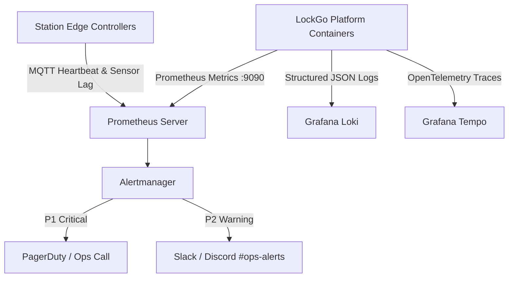

# LOCKGO — SRE Incident Response & Production Runbooks

> **Assessment Section:** SRE Incident Response, Alert Rules & Observability  
> **Role:** Lead Site Reliability Engineer (SRE) & Platform Architect  
> **Platform:** LOCKGO Smart Locker Platform  

---

## 1. Observability Architecture & SLIs / SLOs

### 1.1 Service Level Objectives (SLOs)
- **API Availability:** 99.95% successful requests over 30-day rolling window.
- **Reservation Latency:** P95 < 80ms, P99 < 150ms.
- **Hardware Unlock Reliability:** 99.9% of valid unlock requests trigger door opening within 2000ms.
- **Double Booking Rate:** Strictly 0.000%.

---

## 2. P1 Incident Runbooks

### Runbook 1: High Hardware Sensor Desync Rate (Station Jam / Offline)
- **Alert:** `LockerHardwareDesyncAlert` (Trigger: > 3 consecutive desyncs on same station within 5 minutes).
- **Impact:** Users arrive at station but doors do not unlock or report false closed status.
- **Immediate Mitigation:**
  1. Trigger Edge Diagnostic Poll via MCP / CLI tool: `bun run ops:station-health --station-id <ID>`.
  2. If station relay is unresponsive, flag station status to `DEGRADED_MAINTENANCE` via admin API to stop new bookings.
  3. Re-route active reservation to nearest adjacent available station or trigger automatic refund to user wallet.
  4. Dispatch field technician ticket with sensor GPIO error log.

### Runbook 2: Redis Cluster Partition / Lock Contention Spike
- **Alert:** `RedisLockContentionSpike` (Trigger: Lock acquisition timeout > 500ms for > 10 req/sec).
- **Impact:** Reservation latency spikes, risk of falling back directly to DB pessimistic lock pool.
- **Immediate Mitigation:**
  1. Inspect Redis memory and key eviction stats: `redis-cli info memory`.
  2. Verify if a runaway client leaked locks without TTL (check slowlog: `redis-cli slowlog get 10`).
  3. Force-flush stale lock namespace if orphaned: `EVAL "for i, name in ipairs(redis.call('KEYS', 'lock:compartment:*')) do redis.call('DEL', name); end" 0`.
  4. Rely on Layer 2 (PostgreSQL `SELECT FOR UPDATE`) and Layer 3 (Unique Constraint) which remain 100% intact.

---

## 3. Chaos Engineering & Failure Scenarios Matrix

| Scenario | Injected Fault | Expected System Behavior | Verification Test |
|---|---|---|---|
| **Edge Network Drop** | Cut 4G connection during unlock command | Cloud triggers 2-Phase reconciliation; enters `PENDING_RECONCILIATION`; re-polls upon reconnect. | `tests/iot/reconciliation.test.ts` |
| **Mass Concurrency Blast** | 50 concurrent requests for 1 remaining slot | Exactly 1 request succeeds with 200 OK; 49 requests receive 409 Conflict; 0 double bookings. | `tests/concurrency/double-booking.test.ts` |
| **Replay Attack Injection** | Resubmit captured Dynamic QR token after 35 seconds | Token signature rejected due to expired window; nonce burner rejects duplicate consumption. | `tests/security/dynamic-qr.test.ts` |
| **PostgreSQL Transient Failover** | Kill primary database node | Connection pool fails over to replica; in-flight write transactions retry with exponential backoff. | Automated DB failover chaos suite |
