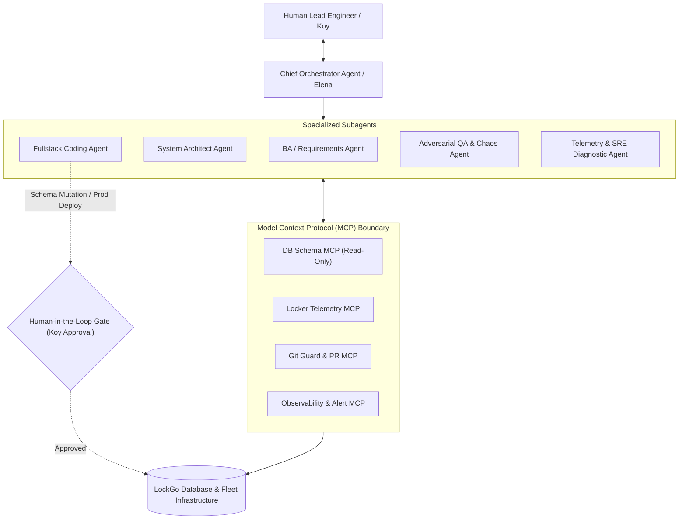

# LOCKGO — AI Multi-Agent Architecture & Model Context Protocol (MCP)

> **Assessment Section:** AI Multi-Agent Ecosystem, MCP Tool Protocol, Context Engineering & AI Governance  
> **Role:** Lead AI Platform Engineer & Multi-Agent Architect  
> **Platform:** LOCKGO Smart Locker Platform  

---

## 1. AI Multi-Agent Ecosystem Architecture

LockGo leverages a specialized **Role-Based Multi-Agent Hierarchy** to accelerate engineering velocity, automate station telemetry diagnostics, and enforce production governance:

---

## 2. Model Context Protocol (MCP) Server Specification

The **LockGo MCP Server** provides standardized, strictly scoped tool primitives for AI agents:

### 2.1 Tool Definitions
1. **`get_station_health(station_id: string)`**
   - *Description:* Fetches real-time sensor states, door statuses, temperature readings, and MQTT connectivity for a physical locker station.
   - *Access Level:* Read-Only (Safe for automated agents).
2. **`query_compartment_availability(station_id: string, size_tier?: string)`**
   - *Description:* Inspects active reservations and compartment availability states.
   - *Access Level:* Read-Only.
3. **`diagnose_lock_reconciliation_incident(incident_id: string)`**
   - *Description:* Pulls correlated MQTT command events, sensor feedback traces, and database status logs to summarize hardware desync root causes.
   - *Access Level:* Read-Only.
4. **`trigger_emergency_door_unlock(station_id: string, compartment_id: string, reason: string)`**
   - *Description:* Issues an administrative solenoid pulse command to unlock a jammed locker for a customer.
   - *Access Level:* **Gated Write (Requires Human Sign-off Approval)**.

---

## 3. Context Engineering & Hallucination Defense

To eliminate "zero-context drift" and ensure all subagents produce code compliant with LockGo standards:
1. **Single Source of Truth (SSOT):** `AGENTS.md`, `ARCHITECTURE.md`, and `docs/DECISIONS.md` are dynamically injected into the system prompt context.
2. **Deterministic Output Formats:** All architectural outputs enforce typed JSON / Markdown schemas.
3. **Static Analysis Feedback Loop:** AI agent code submissions are automatically compiled and verified through `tsc --noEmit`, ESLint, and unit test suites before human review.
