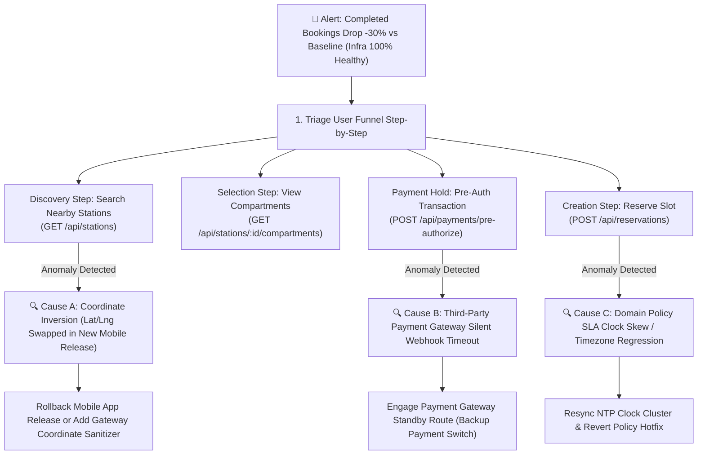

# LOCKGO — SRE Incident Response Runbooks & Operational Playbooks

> **Role:** Site Reliability Engineer (SRE) & Platform Lead  
> **Platform:** LOCKGO — Next-Gen Smart Locker Platform  
> **Author:** Napaporn Suttinarksombat (Koy) & Elena (Technical Assistant)  
> **Version:** 1.4.0 (Comprehensive SRE Incident Runbooks & Triage Framework)

---

## 1. Incident Severity Classification & SLA

| Severity | Definition | Target Response (MTTA) | Target Resolution (MTTR) | Escalation Path |
|---|---|---|---|---|
| **P0 (Critical)** | Core API outage, station fleet unable to unlock, widespread double-booking | < 5 minutes | < 30 minutes | Incident Commander -> Lead SA -> VP Eng |
| **P1 (High)** | Silent conversion drop (-30% bookings), high-traffic station offline, payment gateway failing | < 15 minutes | < 2 hours | Primary SRE on-call -> Domain Lead |
| **P2 (Medium)** | Single compartment jammed/sensor failure, Cold Locker temp threshold warning, Door Ajar | < 30 minutes | < 4 hours | Field Operations / Hardware Technician |
| **P3 (Low)** | Non-critical UI glitch, telemetry logging delay, minor reporting discrepancy | < 2 hours | < 24 hours | Product Backlog / Next Sprint |

---

## 2. Standard Operating Playbooks

### Playbook 1: Station Offline / Network Partition (P1)
- **Symptom:** Station misses 3 consecutive MQTT heartbeats (90s); status flips to `OFFLINE`.
- **Automated Platform Action:**
  1. Temporary hold on new online reservations for this specific station.
  2. Switch Edge Controller to **Offline Buffer Mode** (Edge daemon validates active cached tokens locally via SQLite).
  3. Send silent cellular ping (SMS Wakeup) to station 4G/5G modem.
- **Manual Remediation Steps:**
  1. Check cellular signal strength & IoT SIM data quota in Telco portal.
  2. If modem is frozen: trigger remote hardware power-cycle via smart PDU.
  3. Dispatch field technician if station does not reconnect within 30 minutes.

---

### Playbook 2: Compartment Door Jammed / Solenoid Failure (P2)
- **Symptom:** Unlock command dispatched; solenoid relay pulsed, but sensor remains `CLOSED` after retry.
- **Automated Platform Action:**
  1. Emit `HARDWARE_JAMMED` event -> Trigger 100% Instant Gross Refund to user.
  2. Mark compartment as `PENDING_MAINTENANCE` and allocate adjacent slot if available.
- **Field Ops Remediation (Hot-Swap):**
  1. Field technician arrives with spare solenoid from the **5-10% Spare Parts Buffer**.
  2. Performs **Modular Hot-Swap** (< 20 mins) replacing solenoid and reed switch assembly.
  3. Verifies unlock pulse via Backoffice Diagnostic Tool and clears maintenance flag.

---

### Playbook 3: Concurrency Deadlock / Redis Cluster Node Failure (P0)
- **Symptom:** Redis Redlock timeouts exceed 500ms; reservation latency spikes.
- **Automated Platform Action:**
  1. Redis Cluster initiates automatic failover to replica in < 3 seconds.
  2. Core platform falls back to **Layer 2 Relational Database Locking** (`SELECT ... FOR UPDATE`) ensuring zero data corruption.
- **Manual Remediation Steps:**
  1. Inspect Redis node CPU and memory saturation (`INFO memory`).
  2. Verify DB connection pool headroom (PgBouncer).
  3. Scale up read replicas if load persists.

---

### Playbook 4: Cold Storage Temperature Excursion (P1)
- **Symptom:** Cold compartment temperature rises above 8.0°C for > 5 minutes (10 polling cycles).
- **Automated Platform Action:**
  1. Ingestion worker emits `COLD_TEMPERATURE_EXCURSION`.
  2. Immediately halt all new cold storage bookings at that station.
  3. Dispatch automated SMS / Push notification to users with active perishable items in the affected unit.
- **Manual Remediation Steps:**
  1. Check station refrigeration compressor power line and insulation seal.
  2. If cooling failure is permanent, initiate emergency return/courier dispatch.

---

### Playbook 5: Door Left Ajar Escalation & Investigation (P2)
- **Symptom:** Door reed switch remains `OPEN` for > 180 seconds (3 minutes).
- **Automated Platform Action:**
  1. 30s: Trigger slow buzzer + Push notification to user.
  2. 90s: Trigger high-pitch alarm + SMS warning.
  3. 180s: State transitions to `DOOR_AJAR_ALERT` and transaction marked as `PENDING_INVESTIGATION`.
- **Manual Remediation Steps:**
  1. Central Ops inspects real-time CCTV stream of the station.
  2. Ops agent makes immediate phone call to user to verify status.
  3. If user is unreachable, dispatch nearest Field Ops to physically inspect and close locker door.

---

### Playbook 6: Power Outage / Battery Backup Mode (P1)
- **Symptom:** UPS sends `AC_POWER_LOSS`; Edge transitions to `Emergency Power Saving` and emits `STATION_POWER_DISRUPTED`.
- **Automated Platform Action:**
  1. Instant load-shedding: shut down digital display and cold compressor.
  2. Freeze new bookings; broadcast SMS to active depositors to pick up within 2-3 hours.
  3. Keep 4G router and relay board active on LiFePO4 battery for 2-4 hours.
- **Manual Remediation Steps:**
  1. Monitor battery discharge telemetry in SRE Dashboard.
  2. Contact building facility management regarding AC power restoration schedule.
  3. If battery hits < 10%, verify safe automated OS shutdown occurred without data corruption.

---

### Playbook 7: INC-007 — Silent Conversion Drop (-30% Bookings under Normal Infra Telemetry) (P1) (Topic 11)

#### 1. สถานการณ์และสิ่งที่ต้องตรวจก่อน (Initial Triaging & Symptoms)
- **อาการ:** ยอดการจองสำเร็จ (Completed Reservations) ลดลง **30% ภายใน 30 นาที** เทียบกับ Baseline 7 วันก่อนหน้า แต่ระบบ Monitoring พื้นฐาน (CPU < 25%, RAM < 40%, Disk I/O 0%, DB Connection Pool ว่าง, HTTP 500 = 0%) เป็น **สีเขียว (Healthy) ทั้งหมด**
- **สิ่งที่ต้องตรวจด่วนที่สุด (First 3 Checks):**
  1. ตรวจสอบ **Conversion Funnel Drop-off Matrix** ในแต่ละขั้นตอน (Search Nearby -> View Slots -> Pre-Auth -> Reserve Lock)
  2. ตรวจสอบ **Deployment Timeline** ใน 2 ชั่วโมงล่าสุด (มี Mobile App Release ใหม่, Web Gateway Deployment หรือ Third-Party Gateway API Update หรือไม่)
  3. ตรวจสอบ **Geo-Spatial Distribution** ว่ายอดจองลดลงเฉพาะบางย่าน (e.g. Asoke/Siam) หรือลดลงทั่วทั้งประเทศ



#### 2. Log ที่ต้องดู (Diagnostic Structured Logs & Queries)
1. **API Gateway Access Logs (ค้นหา Zero-Result Searches & Status 4xx):**
   ```sql
   -- ตรวจสอบ Request ที่ค้นหาสถานีแต่ได้ผลลัพธ์ว่างเปล่า (Empty Results)
   SELECT client_version, request_payload->>'lat' AS lat, request_payload->>'lng' AS lng, response_body_count, COUNT(*)
   FROM api_gateway_access_logs
   WHERE path = '/api/stations' AND created_at > NOW() - INTERVAL '30 minutes'
   GROUP BY client_version, lat, lng, response_body_count
   HAVING response_body_count = 0
   ORDER BY count DESC;
   ```
2. **Audit Logs สำหรับ Domain Policy Rejections:**
   ```sql
   -- ตรวจสอบว่ามีคำสั่งจองถูกปฏิเสธด้วย Business Policy หรือไม่
   SELECT action, details->>'reason' AS rejection_reason, COUNT(*)
   FROM audit_logs
   WHERE action = 'DOMAIN_POLICY_REJECTED' AND timestamp > (EXTRACT(EPOCH FROM NOW() - INTERVAL '30 minutes') * 1000)
   GROUP BY action, rejection_reason;
   ```

#### 3. Metrics สำคัญที่ต้องเฝ้าระวัง (Key Metrics & SLOs)
- **Funnel Drop-off Rate per Step:** Discovery-to-Select (เป้าหมาย $\ge 75\%$), Select-to-PreAuth (เป้าหมาย $\ge 60\%$), PreAuth-to-Reserved (เป้าหมาย $\ge 95\%$)
- **P99 API Latency per Route:** `/api/stations` ($< 50\text{ms}$), `/api/payments/pre-authorize` ($< 300\text{ms}$)
- **HTTP 4xx Client Error Ratio:** หาก HTTP 400 หรือ 404 พุ่งสูงขึ้นเกิน $5\%$ ของ Traffic รวม แสดงว่าเกิด Client-Side Contract Incompatibility

#### 4. Trace & Spans (Distributed Tracing Analysis via OpenTelemetry)
- ค้นหา Traces ที่มีสถานะ `HTTP 200` แต่มี `Span Duration > 3000ms` บน Third-Party Payment Egress
- ตรวจสอบ Span: `APIGateway -> Express/Bun Dispatcher -> PaymentGateway.preAuthorize() -> BankWebhook`
- หากพบ Span `PaymentGateway.preAuthorize()` ค้างจน Timeout 5,000ms แล้ว Client กดยกเลิกกลางคัน นั่นคือสาเหตุของ Silent Drop

#### 5. วิธีแยกปัญหา (Root Cause Differential Isolation Matrix)

| สมมติฐานสาเหตุ (Hypothesis) | อาการที่พบใน Log & Trace | เครื่องมือยืนยัน (Verification Tool) | ผลสรุป |
|---|---|---|---|
| **A. Mobile Coordinate Inversion** | ผู้ใช้ค้นหาสถานีสำเร็จ (200 OK) แต่ได้ Array เปล่า `data: []` พิกัดใน Log เป็น `lat: 100.56, lng: 13.73` (สลับพิกัดไทย) | PostGIS ST_DWithin Test Query | **Client App Release Bug** |
| **B. Payment Gateway Silent Latency** | Pre-Auth ค้างเกิน 8 วินาที ผู้ใช้กดยกเลิกหน้าจอก่อนจ่ายสำเร็จ | OpenTelemetry Trace Spans | **Third-Party Provider Degraded** |
| **C. NTP Clock Skew บน API Nodes** | Food SLA Reject บ่นว่าเวลาหมดอายุติดลบ (`holdDuration <= 0`) | `chronyc tracking` บนโหนด API | **Infrastructure Clock Drift** |

#### 6. วิธี Rollback & บรรเทาผลกระทบละเอียดทีละขั้นตอน (Step-by-Step Rollback & Immediate Mitigation)
1. **กรณีเป็น Coordinate Inversion จาก Mobile Release:**
   - **มาตรการเฉพาะหน้า (Hotfix in < 2 นาที):** เปิดใช้งาน API Gateway Edge Rule (Envoy / Traefik WASM Filter) ทำ Coordinate Sanitizer: หาก `lat > 90.0` ให้สลับ `lat` กับ `lng` อัตโนมัติก่อนส่งเข้า PostGIS
   - **Rollback Client:** ปิดบังคับอัปเดตเวอร์ชันใหม่ใน Firebase Remote Config และสั่ง Rollback ใน Play Store / App Store
2. **กรณีเป็น Payment Gateway Timeout:**
   - **สลับ Standby Route (Failover in < 1 นาที):** สลับ Feature Flag `PAYMENT_GATEWAY_PROVIDER=BACKUP_PROVIDER_B` ผ่าน LaunchDarkly / Redis Config
3. **คำสั่ง Rollback Container Deployment (กรณีเกิดจาก Backend Release):**
   ```bash
   # 1. Rollback Deployment บน Kubernetes / Docker Swarm
   kubectl rollout undo deployment/lockgo-api-core --to-revision=PREVIOUS_REVISION
   
   # 2. ตรวจสอบสถานะ Pods และ Healthcheck
   kubectl rollout status deployment/lockgo-api-core
   curl -f http://localhost:3000/api/health
   ```

#### 7. วิธีป้องกันไม่ให้เกิดซ้ำ (Post-Mortem & Preventative Measures)
1. **Automated Synthetic Canary User (E2E Probing):** สร้าง Synthetic Worker อัตโนมัติรันทุก **2 นาที** ดำเนินการค้นหาตู้ -> จองช่องทดสอบ -> Pre-auth 1 บาท -> ปลดล็อก -> ยกเลิก หาก Canary ล้มเหลวให้ยิง Alert P1 เข้า PagerDuty ทันทีโดยไม่ต้องรอให้ยอดรวมตก 30%
2. **Contract-Driven API Testing:** บังคับรัน OpenAPI Schema Validation ใน CI/CD ทุกครั้งที่ Frontend / Mobile Release
3. **NTP Monitoring Alert:** ตั้ง Alert บน Prometheus หาก NTP Offset บนโหนดใดๆ เกิน $50\text{ms}$ ให้แจ้งเตือนทันที
