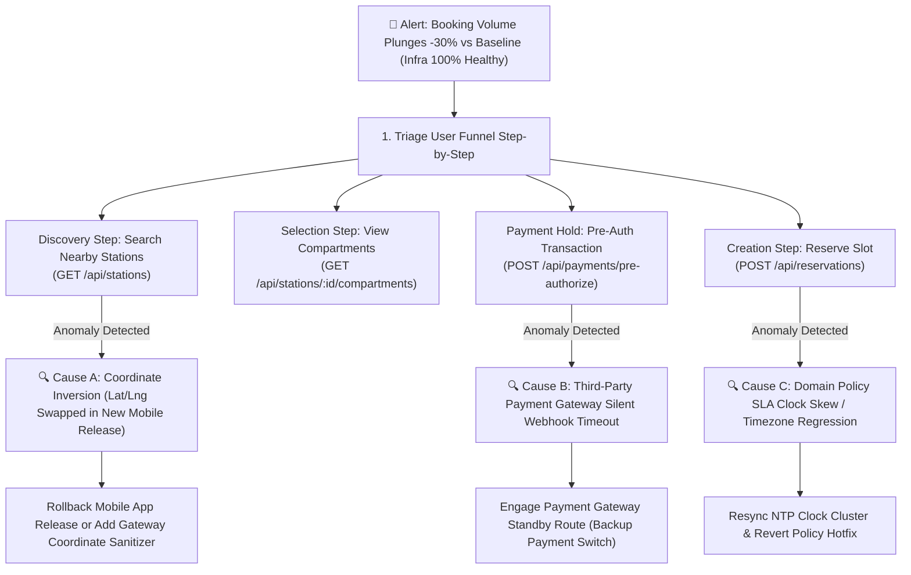

# LOCKGO — SRE Incident Response Runbooks & Operational Playbooks

> **Role:** Site Reliability Engineer (SRE) & Platform Lead  
> **Platform:** LOCKGO — Next-Gen Smart Locker Platform  
> **Author:** Napaporn Suttinarksombat (Koy) & Elena (Technical Assistant)  
> **Version:** 1.3.0 (Production SRE Runbooks with Silent Drop Playbook)

---

## 1. Incident Severity Classification & SLA

| Severity | Definition | Target Response (MTTA) | Target Resolution (MTTR) | Escalation Path |
|---|---|---|---|---|
| **P0 (Critical)** | Core API outage, station fleet unable to unlock, widespread double-booking | < 5 minutes | < 30 minutes | Incident Commander -> Lead SA -> VP Eng |
| **P1 (High)** | Silent conversion drop (-30% bookings), high-traffic station offline, payment gateway failing | < 15 minutes | < 2 hours | Primary SRE on-call -> Domain Lead |
| **P2 (Medium)** | Single compartment jammed/sensor failure, Cold Locker temp threshold warning, Door Ajar | < 30 minutes | < 4 hours | Field Operations / Hardware Technician |
| **P3 (Low)** | Non-critical UI glitch, telemetry logging delay, minor reporting discrepancy | < 2 hours | < 24 hours | Product Backlog / Next Sprint |

---

## 2. Standard Operating Playbooks

### Playbook 1: Station Offline / Network Partition (P1)
- **Symptom:** Station misses 3 consecutive MQTT heartbeats (90s); status flips to `OFFLINE`.
- **Automated Platform Action:**
  1. Temporary hold on new online reservations for this specific station.
  2. Switch Edge Controller to **Offline Buffer Mode** (Edge daemon validates active cached tokens locally via SQLite).
  3. Send silent cellular ping (SMS Wakeup) to station 4G/5G modem.
- **Manual Remediation Steps:**
  1. Check cellular signal strength & IoT SIM data quota in Telco portal.
  2. If modem is frozen: trigger remote hardware power-cycle via smart PDU.
  3. Dispatch field technician if station does not reconnect within 30 minutes.

---

### Playbook 2: Compartment Door Jammed / Solenoid Failure (P2)
- **Symptom:** Unlock command dispatched; solenoid relay pulsed, but sensor remains `CLOSED` after retry.
- **Automated Platform Action:**
  1. Emit `HARDWARE_JAMMED` event -> Trigger 100% Instant Gross Refund to user.
  2. Mark compartment as `PENDING_MAINTENANCE` and allocate adjacent slot if available.
- **Field Ops Remediation (Hot-Swap):**
  1. Field technician arrives with spare solenoid from the **5-10% Spare Parts Buffer**.
  2. Performs **Modular Hot-Swap** (< 20 mins) replacing solenoid and reed switch assembly.
  3. Verifies unlock pulse via Backoffice Diagnostic Tool and clears maintenance flag.

---

### Playbook 3: Concurrency Deadlock / Redis Cluster Node Failure (P0)
- **Symptom:** Redis Redlock timeouts exceed 500ms; reservation latency spikes.
- **Automated Platform Action:**
  1. Redis Cluster initiates automatic failover to replica in < 3 seconds.
  2. Core platform falls back to **Layer 2 Relational Database Locking** (`SELECT ... FOR UPDATE`) ensuring zero data corruption.
- **Manual Remediation Steps:**
  1. Inspect Redis node CPU and memory saturation (`INFO memory`).
  2. Verify DB connection pool headroom (PgBouncer).
  3. Scale up read replicas if load persists.

---

### Playbook 4: Cold Storage Temperature Excursion (P1)
- **Symptom:** Cold compartment temperature rises above 8.0°C for > 5 minutes (10 polling cycles).
- **Automated Platform Action:**
  1. Ingestion worker emits `COLD_TEMPERATURE_EXCURSION`.
  2. Immediately halt all new cold storage bookings at that station.
  3. Dispatch automated SMS / Push notification to users with active perishable items in the affected unit.
- **Manual Remediation Steps:**
  1. Check station refrigeration compressor power line and insulation seal.
  2. If cooling failure is permanent, initiate emergency return/courier dispatch.

---

### Playbook 5: Door Left Ajar Escalation & Investigation (P2)
- **Symptom:** Door reed switch remains `OPEN` for > 180 seconds (3 minutes).
- **Automated Platform Action:**
  1. 30s: Trigger slow buzzer + Push notification to user.
  2. 90s: Trigger high-pitch alarm + SMS warning.
  3. 180s: State transitions to `DOOR_AJAR_ALERT` and transaction marked as `PENDING_INVESTIGATION`.
- **Manual Remediation Steps:**
  1. Central Ops inspects real-time CCTV stream of the station.
  2. Ops agent makes immediate phone call to user to verify status.
  3. If user is unreachable, dispatch nearest Field Ops to physically inspect and close locker door.

---

### Playbook 6: Power Outage / Battery Backup Mode (P1)
- **Symptom:** UPS sends `AC_POWER_LOSS`; Edge transitions to `Emergency Power Saving` and emits `STATION_POWER_DISRUPTED`.
- **Automated Platform Action:**
  1. Instant load-shedding: shut down digital display and cold compressor.
  2. Freeze new bookings; broadcast SMS to active depositors to pick up within 2-3 hours.
  3. Keep 4G router and relay board active on LiFePO4 battery for 2-4 hours.
- **Manual Remediation Steps:**
  1. Monitor battery discharge telemetry in SRE Dashboard.
  2. Contact building facility management regarding AC power restoration schedule.
  3. If battery hits < 10%, verify safe automated OS shutdown occurred without data corruption.

---

### Playbook 7: INC-007 — Silent Conversion Drop (-30% Bookings under Normal Infra Telemetry) (P1) (Topic 11)

#### 1. Scenario Description
ยอดการจองตู้ลดฮวบลง 30% อย่างผิดปกติ แต่ระบบ Monitoring พื้นฐาน (Server CPU, RAM, Disk I/O, Database Load, Network Bandwidth) แสดงผลเป็นสีเขียว (Normal) 100% ทุกตัว



#### 2. Root Cause Hypotheses & Diagnostic Flow
1. **Hypothesis 1: Client Coordinate Inversion (Lat/Lng Swapped):**
   - การปล่อยแอปมือถือเวอร์ชันใหม่สลับค่า `latitude` กับ `longitude` (เช่น ส่ง `100.56, 13.73` แทน `13.73, 100.56`) ส่งผลให้ PostGIS ค้นหาไม่พบสถานีใกล้เคียงในรัศมี ทำให้ผู้ใช้ไม่เห็นตู้ว่าง
   - **Diagnostic Query:**
     ```sql
     SELECT request_payload->>'lat' AS lat, request_payload->>'lng' AS lng, COUNT(*)
     FROM api_gateway_access_logs
     WHERE path = '/api/stations' AND created_at > NOW() - INTERVAL '1 hour'
     GROUP BY lat, lng HAVING CAST(request_payload->>'lat' AS FLOAT) > 90.0;
     ```
2. **Hypothesis 2: Third-Party Payment Gateway Silent Webhook Timeout:**
   - เซิร์ฟเวอร์และฐานข้อมูลปกติ แต่ Payment Gateway มีอาการ Latency สูง (> 10s) ทำให้ผู้ใช้กดยกเลิกกลางคันก่อน Pre-Auth สำเร็จ
   - **Diagnostic Check:** ตรวจสอบ P99 Response Time บน Endpoint `/api/payments/pre-authorize` และสถานะ Gateway Integration
3. **Hypothesis 3: Domain Policy SLA Regression / Clock Skew:**
   - เซิร์ฟเวอร์ API บางตัวมี NTP Clock Drift ทำให้คำสั่งตรวจสอบอาหาร (Food 120m SLA) ตีความเป็นเวลาติดลบและปฏิเสธคำขอ (`DOMAIN_POLICY_REJECTED`)

#### 3. Immediate SRE Triage & Mitigation Actions
1. **Step 1 (Isolate Drop-off Stage):** สรุป Conversion Rate ต่อ Step ใน Funnel เทียบกับ Baseline 7 วันก่อนหน้า เพื่อหาขั้นตอนที่ Drop-off สูงผิดปกติ
2. **Step 2 (Inspect Error Distribution):** ตรวจสอบ HTTP Status 4xx (เช่น 400 Domain Reject หรือ 404 No Station Found) ผ่าน Structured Audit Logs
3. **Step 3 (Mitigate):**
   - หากเป็น Coordinate Bug ในแอป: เปิดใช้งาน Layer Gateway Adapter ให้ช่วยตรวจจับและสลับพิกัด Lat/Lng อัตโนมัติทันทีที่ขอบเขตผิดปกติ
   - หากเป็น Payment Gateway ช้า: สลับ Routing ไปยัง Backup Payment Provider ผ่าน Feature Flag
