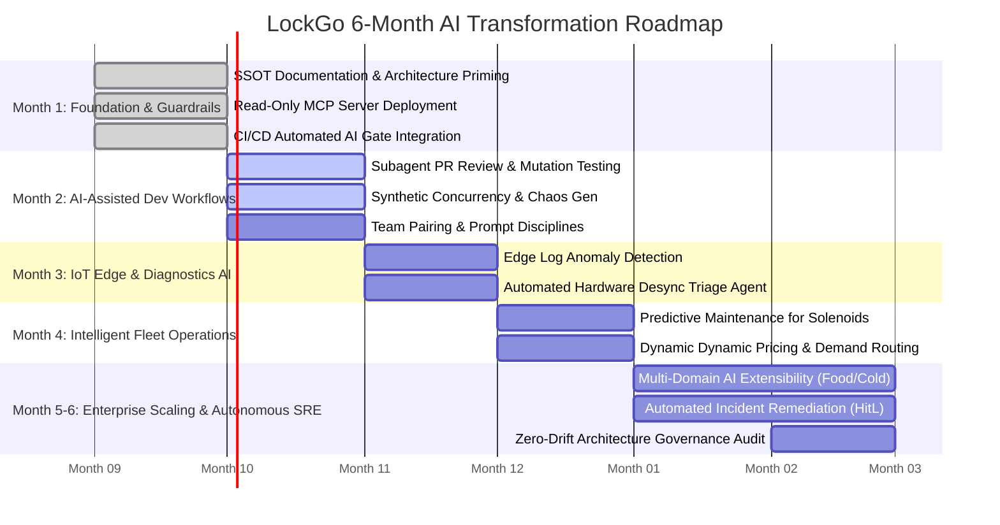

# LOCKGO — 6-Month AI Transformation & Platform Scaling Roadmap

> **Assessment Section:** 6-Month AI Transformation, Team Upskilling & Platform Scaling  
> **Role:** Senior AI Fullstack Platform Engineering Lead  
> **Platform:** LOCKGO Smart Locker Platform  

---

## 1. Executive Vision & Transformation Goals

Transform LockGo from a standard IoT software platform into an **AI-Native, High-Velocity Engineering Organization**, reducing time-to-market for new vertical domains by 65% while maintaining 99.95% production reliability and 0% security breaches.

---

## 2. Key Performance Indicators (KPIs) & ROI

| Metric | Pre-AI Baseline | Target (6-Month AI Native) | Impact |
|---|---|---|---|
| **New Domain Vertical Delivery Time** | 6 Weeks | 1.5 Weeks | **75% Faster** |
| **P1 Hardware Incident Triage Time (MTTR)** | 45 Minutes | < 3 Minutes | **93% Reduction** |
| **Automated Test Coverage (Unit + Chaos)** | 60% | > 92% | **Substantial Bug Reduction** |
| **Developer Productivity & Satisfaction** | Baseline | 2.8x Output per Engineer | **High Velocity & Retention** |
