# LOCKGO — Technical Interview Presentation & Defense Guide (90 Minutes)

> **Platform:** LOCKGO — Next-Gen Smart Locker Platform  
> **Candidate:** Napaporn Suttinarksombat (Koy)  
> **Role:** Senior AI Fullstack Platform Engineer  
> **Score Target:** 100 / 100 Points  
> **Version:** 2.0.0 (Comprehensive Technical Defense Strategy)

---

## 💎 The Golden Question (หัวใจสำคัญที่สุดในการสัมภาษณ์)

> **คำถาม:** *"ถ้า AI สามารถเขียน Code ได้มากขึ้นเรื่อย ๆ แล้ว Software Engineer ระดับ Senior ควรสร้างอะไรให้ AI ทำงานได้ดีขึ้น?"*

### 🏆 คำตอบระดับ Senior AI Platform Engineer:
Software Engineer ระดับ Senior ไม่ได้มีหน้าที่แข่งขันเขียนโค้ดกับ AI แต่มีหน้าที่สร้าง **"แท่นปล่อยยานและกำแพงความปลอดภัย (Platform & Guardrails)"** เพื่อให้ AI ทั้งฝูงทำงานได้อย่างแม่นยำ ปลอดภัย และปลดล็อกความเร็วของทีมวิศวกรขึ้น 4-5 เท่า ผ่าน 5 สิ่งสำคัญ:

1. **System Architecture & Bounded Contexts (ขอบเขตสถาปัตยกรรมที่ชัดเจน):**
   - AI ไม่สามารถตัดสินใจ Trade-off ทางธุรกิจได้ Senior ต้องออกแบบ Bounded Contexts, Domain Contracts และเลือก Architectural Pattern (เช่น Modular Monolith vs Microservices) เพื่อกำหนดขอบเขตให้ AI ไม่สร้างโค้ดที่ผูกติดกันจนเละ (Spaghetti Anti-pattern)
2. **Context Engineering & SSOT Architecture (โครงสร้างพื้นฐานด้านบริบท):**
   - AI จะหลอน (Hallucinate) ทันทีหากขาดบริบท Senior ต้องสร้าง Single Source of Truth (SSOT) เช่น `AI-SHARED-CORE.md`, `DECISIONS.md (ADRs)` และเชื่อมต่อผ่าน **Model Context Protocol (MCP)** เพื่อให้ AI เรียกดู Database Schema และ API Specs แบบเรียลไทม์
3. **Automated Verification Harness & Feedback Loops (ระบบตรวจทานอัตโนมัติ):**
   - โค้ดที่ AI สร้างขึ้นไม่มีความหมายหากพิสูจน์ไม่ได้ Senior ต้องสร้าง **Automated Testing Harness** (เช่น Concurrency Race Stress Test 50 workers, Property-based Tests, Strict Typecheck `tsc --noEmit`) เพื่อเป็น Feedback Loop ให้ AI รันตรวจทานและแก้ไขตัวเอง (Self-Healing Code) ได้ทันที
4. **Production Safety & Human-in-the-Loop Governance (กำแพงความปลอดภัยระดับองค์กร):**
   - สร้างกลไก Least-Privilege Scoping บน MCP Tools โดยจำกัดให้ AI มีสิทธิ์เพียง Read-Only และบังคับผ่าน **HMAC-SHA256 Digital Signature Approval Gate** ก่อนทำลายหรือแก้ไขข้อมูลสำคัญ (เช่น Schema Migration, Emergency Unlock, Financial Void)
5. **Developer Platform & Multi-Agent Multiplier (แพลตฟอร์มเพิ่มพลังทีม):**
   - เปลี่ยนกระบวนการส่งมอบงานตั้งแต่ **PRD -> Architecture -> Code -> Test -> Deploy -> Production** ให้กลายเป็น Pipeline ที่มี AI Subagents เฉพาะทางคอยขับเคลื่อน ช่วยให้ทีมพัฒนาขนาด 10-50 คน ส่งมอบงานได้เร็วขึ้นโดยไม่สูญเสียคุณภาพ

---

## ⏱️ โครงสร้างการนำเสนอ 90 นาที (90-Minute Interview Agenda)

```mermaid
gantt
    title โครงสร้างการนำเสนอ Technical Interview 90 นาที
    dateFormat  m
    axisFormat  %m นาที

    section 1. Architecture (20m)
    C4 Container Diagram & Tech Stack Benchmark    :0, 10m
    Trade-offs: Modular Monolith vs Microservices :10, 20m

    section 2. Concurrency & IoT (20m)
    3-Layer Concurrency Defense (0% Double Booking):20, 30m
    IoT 2-Phase State Reconciliation & Debounce    :30, 40m

    section 3. AI & MCP (20m)
    Multi-Agent Hierarchy & MCP Server Design      :40, 50m
    Context Engineering & 6-Month AI Transformation:50, 60m

    section 4. Code & Demo (15m)
    Walkthrough TypeScript Code & Bun Test Suite   :60, 75m

    section 5. Q&A & Defense (15m)
    Deep-Dive Trade-offs & Production Engineering  :75, 90m
```

---

## 📊 เกณฑ์การประเมิน 100 คะแนน และจุดเด่นของงานที่ส่งมอบ

| หัวข้อการประเมิน | คะแนนเต็ม | สิ่งที่ LOCKGO ส่งมอบเพื่อคว้าคะแนนเต็ม (Proof of Mastery) |
|---|---|---|
| **1. Software Architecture** | **20** | - C4 Container Diagram, Domain Strategy Pattern, Strangler Fig Roadmap - บันทึกการตัดสินใจทางสถาปัตยกรรมครบถ้วน 13 ฉบับ ([DECISIONS.md](file:///C:/Projects/personal/lockgo-assessment/docs/DECISIONS.md)) |
| **2. AI Engineering & Agent Design** | **20** | - Role-Based Multi-Agent Hierarchy (BA, SA, PM, DEV, QA, SRE), Agent I/O Table - MCP JSON-RPC 2.0 Server ([src/mcp/server.ts](file:///C:/Projects/personal/lockgo-assessment/src/mcp/server.ts)) พร้อม HMAC Digital Signature Gates |
| **3. Platform Engineering** | **15** | - 3-Layer Concurrency Locking (Redis Redlock -> DB Row Lock -> Partial Unique DB Constraint) - IoT Outbound-Only CGNAT Traversal, 250ms Solenoid pulse, Dual-tier Debounce - Internal Tools Prioritization Matrix (Topic 19: WSJF Framework) |
| **4. Code Quality & Practice** | **15** | - โค้ด TypeScript แท้ 100% Strict Typecheck (`tsc --noEmit` 0 errors) - ผ่าน Automated Test Suite 41/41 เคส ครอบคลุม Concurrency, Dynamic QR, Payment, Ledger, PII Masking, MCP |
| **5. DevOps & Production Engineering** | **10** | - Multi-stage Dockerfile, Docker Compose, GitHub Actions CI/CD Pipeline - SRE Incident Runbooks Playbooks 1-7 ([07_SRE_INCIDENT_RUNBOOK.md](file:///C:/Projects/personal/lockgo-assessment/docs/07_SRE_INCIDENT_RUNBOOK.md)) รวมทั้งกรณี Silent Conversion Drop (-30%) |
| **6. Security & Reliability** | **5** | - Dynamic Rolling TOTP QR 30s + Atomic Nonce Burner ป้องกัน Replay Attack - PDPA PII Masking Engine (เบอร์โทร, เลขบัตรประชาชน 13 หลัก, อีเมล, บัตรเครดิต) - กฎหมาย ธปท., ปปง., และมาตรฐานความน่าเชื่อถือ MIL-HDBK-217F |
| **7. AI Workflow & Context Engineering** | **10** | - SSOT Context Priming Pipeline (`AI-SHARED-CORE.md`, `DECISIONS.md`) - AI Code Review Evolution Artifact (Topic 21: Naive Draft -> Review -> Production Hardening) - แผนงาน 6-Month Enterprise AI Transformation Roadmap |
| **8. Documentation & Communication** | **5** | - เอกสารครอบคลุม 12 รายการ พร้อมผัง Mermaid และ OpenAPI Specification |
| **รวม** | **100** | **ระดับ Senior AI Fullstack Platform Engineer (Production Standard)** |

---

## 🎯 ตารางสรุปสิ่งที่ Implement แล้ว vs สิ่งที่เป็นแนวทางออกแบบ (Scope Transparency)

เพื่อความโปร่งใสและแสดงวุฒิภาวะของวิศวกรระดับ Senior:

| โมดูล / ฟีเจอร์ | สถานะใน 72 ชั่วโมงนี้ | รายละเอียดการพิสูจน์ / แนวทางออกแบบในอนาคต |
|---|---|---|
| **Core Concurrency Engine** | **Implemented (In-Memory Engine)** | พิสูจน์ด้วย Automated Stress Test 50 workers แย่ง 1 slot (0% Double Booking) พร้อม Async Yield |
| **Dynamic Rolling QR & Nonce**| **Implemented 100%** | พิสูจน์ด้วย HMAC Tamper, 30s Expiration, และ Replay Attack Nonce Burner Tests |
| **Kiosk Emergency Backup PIN** | **Implemented 100%** | จัดเก็บ Salt/Hash บน DB Token ฝั่ง Server, เปรียบเทียบด้วย `timingSafeEqual`, และ Brute-force Lockout 15 นาที |
| **Two-Phase Payment & Ledger** | **Implemented (Engine Simulation)** | Pre-Auth, Capture, Idempotent Instant 100% Gross Refund, และ Double-Entry Ledger Entries |
| **PDPA PII Masking Engine** | **Implemented 100%** | Recursive Tokenizer Sanitization สำหรับเบอร์โทร (`081-***-4567`), บัตร ปชช. 13 หลัก (`1-2345-*****-12-3`), อีเมล, บัตรเครดิต |
| **IoT 2-Phase Reconciliation** | **Implemented 100%** | จำลอง MQTT QoS 1, Jammed Solenoid Auto-Void, และ Fallback Sensor Polling |
| **Model Context Protocol (MCP)**| **Implemented 100% (JSON-RPC 2.0)** | Stdio Transport รองรับ `initialize`, `tools/list`, `tools/call` พร้อม HMAC Digital Signature Gate |
| **Live REST API Server** | **Implemented 100%** | รันบน `Bun.serve` พอร์ต 3000 พร้อม Endpoints ครบทุกฟีเจอร์ (รองรับทั้ง `radiusKm` และ `radius`) |
| **Auth & RBAC Service** | **Designed (Blueprint)** | ออกแบบ JWT Claim Structure และ Multi-Tenant Roles (Admin, Field Ops, Driver, Customer) ใน `01_BUSINESS_AND_REQUIREMENTS.md` |
| **Physical Hardware Breadboard**| **Designed (Blueprint)** | มีสเปก ARM SoC, RS-485 Modbus, ATECC608A mTLS, และ RC Debounce ละเอียดใน [05_IOT_HARDWARE_INTEGRATION.md](file:///C:/Projects/personal/lockgo-assessment/docs/05_IOT_HARDWARE_INTEGRATION.md) |
| **Production Testcontainers / k6**| **Designed (Blueprint)** | สเปกสำหรับ CI/CD ใน Production ด้วย Containerized PostgreSQL 16 + Redis Cluster และ k6 1,000 VUs Load Testing ใน `04_TESTING_AND_DEVOPS_STRATEGY.md` |

---

## 🎙️ บทสัมภาษณ์เจาะลึก: การตอบคำถามเรื่อง AI Code Review (Topic 21 Defense Script)

### คำถามที่คาดว่าจะเจอ:
> *"ในเอกสารข้อ 21 มีการแสดง AI Code Review ที่ค้นพบช่องโหว่ระดับวิกฤต เช่น Client Bypass, Timing Attack และ Missing Salt ใน Emergency PIN — ในการทำงานจริง ใครเป็นคนตรวจพบบั๊กพวกนี้ และคุณมีกระบวนการอย่างไร?"*

### แนวทางการตอบของพี่ก้อย (Perfect Answer):
> *"ในการพัฒนาแพลตฟอร์ม LOCKGO หนูไม่ได้ใช้ AI แบบ 'สั่งแล้วเชื่อทันที' (Blind Trust) แต่หนูวางกระบวนการทำงานแบบ **Multi-Agent Adversarial Cross-Verification**:
> 
> 1. เมื่อ Developer Agent สร้างโค้ดฉบับร่างแรก (Initial Naive Draft) ขึ้นมา หนูส่งโค้ดเข้าสู่ไปป์ไลน์ **Adversarial Security Audit (Independent Red Team AI)** เพื่อตรวจจับช่องโหว่ด้านความมั่นคงปลอดภัย
> 2. เมื่อ AI Auditor รายงาน Finding ช่องโหว่ 4 จุด (Client-side PIN bypass, Timing attack จาก `!==`, การขาด Salt ใน DB, และไม่มี Brute-force Lockout) หนูในฐานะ **Senior Lead Architect** ทำหน้าที่เป็น **Human-in-the-Loop Decision Gatekeeper**
> 3. หนูเป็นผู้อนุมัติ Architecture & Security Solution (ADR-012): ตัด `expectedPin` ออกจาก API payload ของ Client, สั่งเก็บ Salt และ HMAC-SHA256 Hash ใน DB Token ฝั่ง Server, บังคับใช้ `crypto.timingSafeEqual`, และตั้ง Brute-force Lockout 15 นาที
> 4. จากนั้นหนูสั่งการให้ AI ดำเนินการ Refactor โค้ดฉบับ Hardened พร้อมเขียน Automated Test Suites คลุมทุกเคส เพื่อล็อกไม่ให้เกิด Regression ซ้ำ
> 
> กระบวนการนี้พิสูจน์ให้เห็นว่า **คุณค่าของ Senior Engineer ในยุค AI ไม่ใช่การเขียนโค้ดเองทั้งหมด แต่คือการเป็นผู้ออกแบบ Architecture, วาง Guardrails และเป็นผู้ตัดสินใจความมั่นคงปลอดภัยขั้นสุดท้าย** ค่ะ"*
